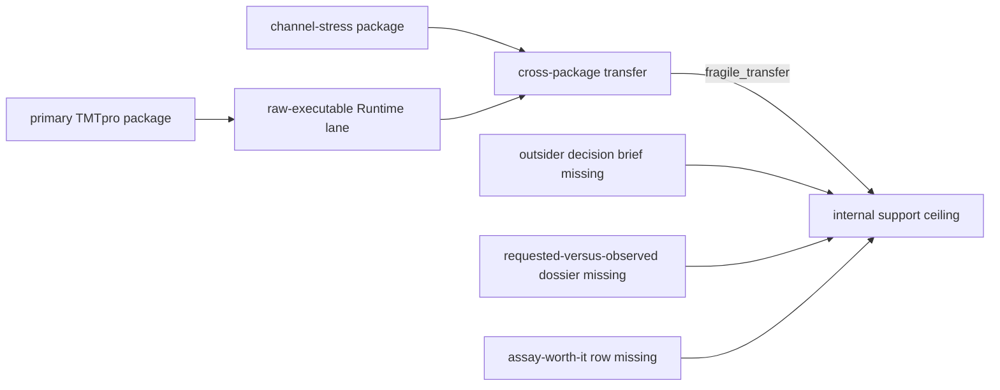

# Why Multiplex Stops At Internal Support

## Internal Support Only

`multiplex` has real scientific and Runtime evidence, but it is not an
outsider-auditable flagship family. Its current transfer and consequence chain
does not support that stronger public posture.

## Evidence Already Present

| Surface | Current evidence | What it establishes |
| --- | --- | --- |
| primary package | `multiplex_tmtpro_review_package` | channel balance, ratio compression, and missing-channel review |
| stress package | `multiplex_channel_stress_review_package` | harsher channel and transfer pressure |
| Runtime | `multiplex-tmtpro-review-corpus` in `raw_executable` mode | repository execution from the checked input level |
| transfer report | `multiplex_channel_stress_review_package/cross_package_generalization.json` | current cross-package result is `fragile_transfer` |

`raw_executable` does not mean vendor-native acquisition replay, stable family
transfer, outsider review closure, or laboratory value. Those are separate
evidence bars.

## Missing Trust Links

- a dedicated outsider decision brief with explicit policy and refusal;
- a requested-versus-observed outcome dossier;
- an assay-worth-it ledger row connecting benefit, burden, controls, and
  outcome;
- transfer evidence strong enough to replace `fragile_transfer` with a
  defensible bounded result.

Because these links are absent, Multiplex has not earned outsider-auditable
flagship family status, lab-consequential authority, or language borrowed from
the DDA, DIA, LFQ, PTM, or targeted trust pages.

## Promotion Rule

Promotion requires all missing links to close together. A second benchmark
package alone is insufficient; a green Runtime rerun alone is insufficient;
and a polished review narrative is insufficient. The generated workflow claim
limits, transfer result, outsider packet, and Lab consequence evidence must
agree on the same bounded sentence.

## Evidence Grounding

- [Workflow Claim Grounding](../../06-bijux-proteomics-knowledge/foundation/workflow-claim-grounding.md)
  tests whether each sentence retains source support.
- [Workflow Literature Audits](../../06-bijux-proteomics-knowledge/foundation/workflow-literature-audits.md)
  exposes citation freshness and unresolved gaps.
- [Workflow Consequence Maps](workflow-consequence-maps.md) shows the downstream
  evidence required before internal support can widen.
