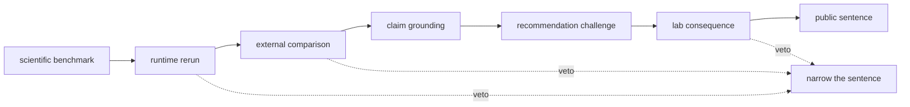

# Workflow Claim Limits

Proteomics support is evaluated one workflow family at a time. A family earns
public confidence only when its scientific benchmark, executable route,
external comparison, evidence review, recommendation challenge, and downstream
consequence can be inspected together.

The checked workflow matrix currently yields these exact sets:

Outsider-auditable workflow families today: `dda`, `dia`, `ptm`, `targeted`.

Full outsider-readable family packets today: `dda`, `dia`, `lfq`, `ptm`, `targeted`.

Internal-support-only workflow families today: `multiplex`.

The three sets are not a maturity ladder. A full packet makes the proof surface
readable by an outsider. Outsider-auditable authority additionally requires the
family to earn every governed authority cell. Internal support identifies a
family whose cross-package evidence is not sufficient for external reliance.
The current release preflight passes with these distinctions intact.

## Current Family Limits

| Family | Family-matrix result | Strongest usable public sentence | Decisive limitation |
| --- | --- | --- | --- |
| DDA | outsider-auditable | bounded outsider-auditable | Search-engine behavior and transfer remain bounded by the shipped DDA lanes and comparator evidence. |
| DIA | outsider-auditable | bounded outsider-auditable | The executable lane remains library-conditioned rather than chromatogram-native replay. |
| LFQ | outsider status not earned | review-grade bounded | Missingness, normalization, sparse-cohort transfer, and external-review pressure remain material. |
| Multiplex | internal support only | internal support only | External comparison and lab-consequence closure do not support an outsider-facing claim. |
| PTM | outsider-auditable | bounded outsider-auditable | Localization evidence is stronger than downstream consequence confidence. |
| Targeted | outsider-auditable | bounded outsider-auditable | Calibration, interference, carryover, and follow-up burden constrain transfer. |

## What Each Classification Means

**Outsider-auditable** means a skeptical reader can open the benchmark package,
runtime evidence, comparison, grounded claim, recommendation packet, and
consequence record without relying on maintainer narration. It does not mean
universal accuracy or transfer.

**Review-grade bounded** means the family has real, inspectable scientific and
operational evidence, but a visible blocker prevents the stronger public
sentence. The blocker is part of the result, not an editorial qualification.

**Internal support only** means implementations and benchmark material exist,
but the cross-package proof chain does not yet support external reliance.

## Evidence threshold

An outsider-readable family packet connects the evidence needed to reproduce
and challenge the public sentence:

- two public benchmark packages plus one published cross-package
  generalization report;
- `family_stability_scorecard.json` with family-specific perturbation and
  transfer results;
- a canonical runtime lane, rerun dossier, artifact ledger, and comparison
  evidence;
- grounded support, contradiction, and citation context;
- a challenged recommendation packet with sensitivity and downgrade evidence;
- a requested-versus-observed outcome dossier and an assay-worth-it ledger row
  when laboratory consequence is claimed.

Missing one of these artifacts narrows the corresponding authority cell. It
does not disappear because adjacent packages carry stronger evidence.

## How to Audit a Family

1. Open its tracked benchmark packages and cross-package generalization report.
2. Confirm whether the strongest runtime route is raw-executable or import-only.
3. Inspect comparator posture, known limits, and unsupported-claim records.
4. Review the recommendation challenge and downgrade evidence.
5. Confirm that requested-versus-observed outcomes and assay-worth records exist.
6. Use the weakest result from those surfaces as the family claim.

The [public artifact index](public-artifact-index.md) gives the inspection order.
The [black-box benchmark dashboard](../../09-bijux-proteomics-runtime/black-box-benchmark-dashboard.md)
shows the current runtime verdicts, and [current capability limits](current-capability-limits.md)
explains why a technically substantial family may still carry a narrow public
sentence.

## Claims These Classifications Do Not Support

- equivalence across instruments, cohorts, search engines, or acquisition modes;
- biological truth merely because a workflow executed reproducibly;
- laboratory usefulness without a consequence record;
- promotion of a weaker family from evidence earned by a stronger neighbor;
- repository-wide trust inferred from any single family packet.

When the family matrix and a live gate disagree, the weaker result governs
until the evidence and classification agree again.
