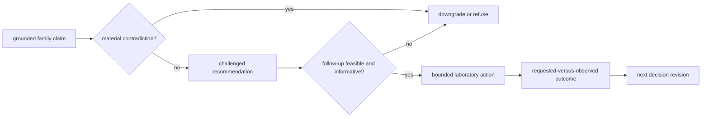

# Workflow Consequence Maps

Each workflow family starts from contradiction pressure, passes through a recommendation posture, and ends at assay burden and the cost of being wrong.

The value of this page is that it keeps the repository from pretending those three layers are interchangeable. A workflow family can have a strong benchmark packet, a convincing rerun lane, and still stop at a weaker public sentence because the downstream cost of being wrong remains too high.

## Consequence Rule

- These are not vote tallies. The weakest downstream boundary controls the strongest honest public sentence.
- A family can look benchmark-strong and still remain recommendation-bounded once comparator pressure, assay burden, or follow-up failure stays unresolved.
- Use the family map to identify the contradiction, control demand, or consequence cost that enforces the downgrade.

The maps constrain action, not the underlying analytical record. A laboratory refusal does not erase a valid identification or quantification result; it says that the proposed use of that result is not justified under the current controls, burden, and authority.

| workflow family | knowledge posture | recommendation posture | lab posture | weakest allowed posture |
| --- | --- | --- | --- | --- |
| `dda` | `recommend_with_downgrade` | `recommend_with_downgrade` | `recommend_with_downgrade` | `recommend_with_downgrade` |
| `dia` | `recommend_with_downgrade` | `recommend_with_downgrade` | `recommend_with_downgrade` | `recommend_with_downgrade` |
| `lfq` | `recommend_with_downgrade` | `recommend_with_downgrade` | `recommend_with_downgrade` | `recommend_with_downgrade` |
| `multiplex` | `do_not_recommend` | `do_not_recommend` | `do_not_recommend` | `do_not_recommend` |
| `ptm` | `recommend_with_downgrade` | `recommend_with_downgrade` | `recommend_with_downgrade` | `recommend_with_downgrade` |
| `targeted` | `recommend_with_downgrade` | `recommend_with_downgrade` | `recommend_with_downgrade` | `recommend_with_downgrade` |

## Family Maps

### `dda`

- knowledge posture: `recommend_with_downgrade`
- recommendation posture: `recommend_with_downgrade`
- lab posture: `recommend_with_downgrade`
- current strongest allowed posture: `recommend_with_downgrade`
- decision-grade remains blocked when the weakest downstream boundary stays below a full recommendation.

- contradiction pressure: Cross-engine DDA drift still makes protein-facing promotion unsafe beyond the bounded benchmark story.
- knowledge next action: Promote the paired DDA transfer loss into a dedicated literature-backed claim row and keep protein-facing trust downgraded until live replay or stronger cross-engine proof lands.
- recommendation summary: Current recommendation posture is `recommend_with_downgrade`
- recommendation blockers: external comparator claim support is still advisory, claim support is not yet strong enough for an unqualified recommendation
- assay burden and follow-up posture: Lab posture is `exploratory_only` with strategy: Run one reviewable DDA confirmation lane with fresh digest material, pooled reference, and contaminant surveillance before broad biology is promoted.
- control demands: blank, pooled_reference, digest_reproducibility_reference, carryover_blank
- burden tradeoffs: The assay is comparatively affordable, but its value collapses if contaminant and target-decoy checks are skipped., Confidence gain comes from reproducing identification semantics, not from discovering new biology.
- cost of being wrong: shared-peptide pressure changes protein-level conclusions even when peptide counts look stable, contaminant promotion inflates confidence when blank carryover is not inspected
- evidence paths: `artifacts/intelligence/recommendation-packets/dda.json`, `comparator drift or missing external execution parity still materially limits this public workflow claim`, `contradiction_triage:dda:1`, `artifacts/lab/flagship-follow-up-packets/dda.json`, `blank`, `pooled_reference`, `digest_reproducibility_reference`, `carryover_blank`, `artifacts/lab/flagship-follow-up-outcomes/dda.json`

### `dia`

- knowledge posture: `recommend_with_downgrade`
- recommendation posture: `recommend_with_downgrade`
- lab posture: `recommend_with_downgrade`
- current strongest allowed posture: `recommend_with_downgrade`
- decision-grade remains blocked when the weakest downstream boundary stays below a full recommendation.

- contradiction pressure: DIA transition-grade confidence still conflicts with wider vendor- and library-parity expectations outsiders may assume.
- knowledge next action: Keep DIA bounded to library-conditioned review until broader vendor-conditioned confrontation and rerun proof exist.
- recommendation summary: Current recommendation posture is `recommend_with_downgrade`
- recommendation blockers: external comparator claim support is still advisory, claim support is not yet strong enough for an unqualified recommendation, vendor and library comparison gaps remain open
- assay burden and follow-up posture: Lab posture is `exploratory_only` with strategy: Run one DIA follow-up that keeps library reference and pooled reference material in the queue, then separate exploratory extraction from any decision-worthy claim.
- control demands: blank, pooled_reference, library_reference, bridge_sample
- burden tradeoffs: The assay can reduce uncertainty, but only if the library-conditioned surface is kept honest in the run design itself., Operational burden is moderate because the queue must preserve a reference-rich structure rather than a single sample injection.
- cost of being wrong: library incompleteness hides true peptide absence behind extraction failure, ion-mobility or vendor-conditioned assumptions make the output look richer than the evidence posture warrants
- evidence paths: `artifacts/intelligence/recommendation-packets/dia.json`, `comparator drift or missing external execution parity still materially limits this public workflow claim`, `contradiction_triage:dia:1`, `artifacts/lab/flagship-follow-up-packets/dia.json`, `blank`, `pooled_reference`, `library_reference`, `bridge_sample`, `artifacts/lab/flagship-follow-up-outcomes/dia.json`

### `lfq`

- knowledge posture: `recommend_with_downgrade`
- recommendation posture: `recommend_with_downgrade`
- lab posture: `recommend_with_downgrade`
- current strongest allowed posture: `recommend_with_downgrade`
- decision-grade remains blocked when the weakest downstream boundary stays below a full recommendation.

- contradiction pressure: LFQ review-grade abundance confidence still conflicts with the harder cohort and missingness behavior named by the literature.
- knowledge next action: Keep LFQ decision-grade wording blocked until harsher cohort pressure and observed outcome closure both exist.
- recommendation summary: Current recommendation posture is `recommend_with_downgrade`
- recommendation blockers: external comparator claim support is still advisory, claim support is not yet strong enough for an unqualified recommendation
- assay burden and follow-up posture: Lab posture is `exploratory_only` with strategy: Run one LFQ replicate-expansion and batch-bridge follow-up only if the study design can honestly absorb more replicates and preserve predeclared contrasts.
- control demands: blank, pooled_reference, batch_bridge, replicate_balance_audit
- burden tradeoffs: LFQ follow-up can be moderately expensive while still failing to change belief if the replicate design remains weak., Confidence gain is capped because missingness and normalization pressure can survive a larger queue.
- cost of being wrong: MNAR missingness makes the apparent rescue of a contrast look stronger than it is, batch drift dominates the signal when bridge material is absent or underused
- evidence paths: `artifacts/intelligence/recommendation-packets/lfq.json`, `comparator drift or missing external execution parity still materially limits this public workflow claim`, `contradiction_triage:lfq:1`, `artifacts/lab/flagship-follow-up-packets/lfq.json`, `blank`, `pooled_reference`, `batch_bridge`, `replicate_balance_audit`, `artifacts/lab/flagship-follow-up-outcomes/lfq.json`

### `multiplex`

- knowledge posture: `do_not_recommend`
- recommendation posture: `do_not_recommend`
- lab posture: `do_not_recommend`
- current strongest allowed posture: `do_not_recommend`
- decision-grade remains blocked when the weakest downstream boundary stays below a full recommendation.

- contradiction pressure: Multiplex has a paired public benchmark surface, but the companion stress result defeats outsider authority and no dedicated lab consequence packet closes the downstream gap.
- knowledge next action: Keep multiplex internal support only until companion pressure passes and dedicated outsider review and lab consequence packets exist.
- recommendation summary: Current recommendation posture is `do_not_recommend`
- recommendation blockers: public comparator-backed claim support is refused, biological grounding remains thin, vendor and library comparison gaps remain open, operational burden remains too high for a justified recommendation
- assay burden and follow-up posture: No dedicated lab follow-up packet is published for this family.
- control demands: none
- burden tradeoffs: none
- cost of being wrong: none
- evidence paths: `artifacts/intelligence/recommendation-packets/multiplex.json`, `this benchmark has no external comparator path, so release-facing workflow support claims stay refused`, `contradiction_triage:multiplex:1`

### `ptm`

- knowledge posture: `recommend_with_downgrade`
- recommendation posture: `recommend_with_downgrade`
- lab posture: `recommend_with_downgrade`
- current strongest allowed posture: `recommend_with_downgrade`
- decision-grade remains blocked when the weakest downstream boundary stays below a full recommendation.

- contradiction pressure: PTM localization confidence still conflicts with the temptation to read occupancy or regulation into a narrower phospho-oriented evidence surface.
- knowledge next action: Keep PTM release language bounded to localization and ambiguity until broader family-specific comparator pressure exists.
- recommendation summary: Current recommendation posture is `recommend_with_downgrade`
- recommendation blockers: operational burden remains too high for a justified recommendation, external comparator claim support is still advisory, claim support is not yet strong enough for an unqualified recommendation
- assay burden and follow-up posture: Lab posture is `exploratory_only` with strategy: Run one PTM validation lane only if a site-targetable follow-up can preserve localized fragments, modified-versus-unmodified counterparts, and orthogonal confirmation.
- control demands: enrichment_blank, site_localization_reference, unmodified_counterpart_control
- burden tradeoffs: PTM follow-up is expensive because ambiguity resolution and orthogonal confirmation are both first-class dependencies., Confidence gain stays low when the benchmark review is still thin and comparator-backed support is refused.
- cost of being wrong: site ambiguity survives the rerun and leaves the lab with a more expensive version of the same story, enrichment or motif pressure creates a convincing signal without a targetable site-specific conclusion
- evidence paths: `artifacts/intelligence/recommendation-packets/ptm.json`, `comparator drift or missing external execution parity still materially limits this public workflow claim`, `contradiction_triage:ptm:1`, `artifacts/lab/flagship-follow-up-packets/ptm.json`, `enrichment_blank`, `site_localization_reference`, `unmodified_counterpart_control`, `artifacts/lab/flagship-follow-up-outcomes/ptm.json`

### `targeted`

- knowledge posture: `recommend_with_downgrade`
- recommendation posture: `recommend_with_downgrade`
- lab posture: `recommend_with_downgrade`
- current strongest allowed posture: `recommend_with_downgrade`
- decision-grade remains blocked when the weakest downstream boundary stays below a full recommendation.

- contradiction pressure: Targeted operator-facing confidence still conflicts with missing Skyline-class comparator and calibration realism.
- knowledge next action: Keep targeted language out of calibration-clean and vendor-parity authority until the missing confrontation lands.
- recommendation summary: Current recommendation posture is `recommend_with_downgrade`
- recommendation blockers: operational burden remains too high for a justified recommendation, external comparator claim support is still advisory, claim support is not yet strong enough for an unqualified recommendation
- assay burden and follow-up posture: Lab posture is `exploratory_only` with strategy: Run one targeted transition panel only if heavy references, calibration standards, and interference review are already secured for the prioritized transitions.
- control demands: blank, heavy_reference, calibration_standard, interference_scout_injection
- burden tradeoffs: Targeted follow-up can look operationally mature while still inheriting thin biological grounding from the discovery layer., Confidence gain depends on interference and calibration discipline, not on the presence of a neat panel alone.
- cost of being wrong: coeluting interference produces clean-looking transitions that still misstate the biology, heavy-light mismatch or calibration drift turns the panel into an operationally neat but scientifically weak artifact
- evidence paths: `artifacts/intelligence/recommendation-packets/targeted.json`, `comparator drift or missing external execution parity still materially limits this public workflow claim`, `contradiction_triage:targeted:1`, `artifacts/lab/flagship-follow-up-packets/targeted.json`, `blank`, `heavy_reference`, `calibration_standard`, `interference_scout_injection`, `artifacts/lab/flagship-follow-up-outcomes/targeted.json`

## Continue From Consequence

- Open [What Changed The Recommendation](https://bijux.io/bijux-proteomics/01-bijux-proteomics/foundation/what-changed-the-recommendation/) when the question is which evidence axis or observed outcome actually moved the call.
- Open [Outcome Learning Loops](https://bijux.io/bijux-proteomics/07-bijux-proteomics-lab/foundation/outcome-learning-loops/) when the question is how requested-versus-observed follow-up should tighten the next recommendation.
- Open [Workflow Refusal Handbook](https://bijux.io/bijux-proteomics/07-bijux-proteomics-lab/foundation/workflow-refusal-handbook/) when the question is whether the honest next action is to stop, rerun, narrow, or refuse.

## Resulting Interpretation

The family table states the permitted posture. The family map names the exact contradiction, control demand, burden, and cost-of-error record responsible for that posture. If those records cannot be resolved, the posture is not independently reviewable.
