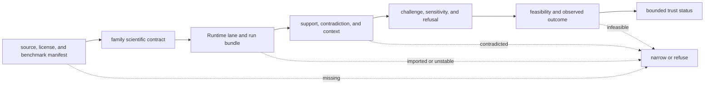

# Workflow Families

Support is evaluated separately for `dda`, `dia`, `lfq`, `multiplex`, `ptm`,
and `targeted`. Each family has different source material, scientific
assumptions, executable lanes, failure modes, comparison rules, and downstream
consequences. Evidence from one family does not raise another family’s status.

## Current Family Status

The trust status below is the strongest language defended by the checked
benchmark package and black-box Runtime evidence. It is a ceiling, not a
promise that every dataset inside the family will meet the same result.

| family | trust status | primary run mode | benchmark coverage | current blockers |
| --- | --- | --- | --- | --- |
| `dda` | `review_grade_bounded` | `import_only` | MaxQuant primary package, Comet/Sage companion pressure, reviewed PSM/FDR/inference outputs | no repository-owned raw search execution; imported engines and parameters bound parity |
| `dia` | `outsider_auditable_bounded` | `raw_executable` over checked reports | Spectronaut primary package, DIA-NN matrix-shift companion, library-aware QC and comparison | no chromatogram-native replay; library completeness and absent-peptide consequences remain bounded |
| `lfq` | `outsider_auditable_bounded` | `raw_executable` over checked features | cohort primary package, sparse-contrast companion, normalization and missingness pressure | cohort transfer and external truth beyond repeatability remain bounded |
| `multiplex` | `internal_support_only` | `raw_executable` over checked features | TMTpro primary package, channel-stress companion, ratio and interference surfaces | transfer is fragile; outsider review and laboratory consequence are not closed |
| `ptm` | `outsider_auditable_bounded` | `raw_executable` over checked localization inputs | localization primary package, ambiguity companion, site mapping and site-level review | function, occupancy, and regulatory consequence remain weaker than localization |
| `targeted` | `outsider_auditable_bounded` | `raw_executable` over checked targeted QC | transition primary package, carryover companion, panel and follow-up records | vendor parity, calibration transfer, matrix interference, and assay burden remain bounded |

`raw_executable` means the repository can execute its declared transformation
from the checked scientific inputs. It does not mean vendor-native raw files
are processed for every family. `import_only` means the strongest lane begins
with results produced by an external engine and preserves their provenance
through owned review contracts. Neither mode is an accuracy grade.

## Evidence Ladder

The weakest required layer determines the public claim. A complete Runtime
bundle cannot compensate for an unclear scientific acceptance policy. A
grounded claim cannot compensate for a recommendation that reverses under a
small policy change. A recommendation cannot compensate for infeasible or
uninformative laboratory follow-up.

## Resolve One Family Verdict

A family verdict is a join across independently reviewable records, not an
average of reassuring signals. Start with the requested public language and
walk left to right. At the first failed or missing contract, stop and lower the
language to the strongest posture that the remaining evidence supports.

| review question | record that answers it | narrowing condition |
| --- | --- | --- |
| Can the source be identified and rebuilt? | package manifest, citation manifest, generated boundary | unknown source identity, prohibited redistribution, or irreproducible selection |
| Does the scientific contract match the family? | family invariants, acceptance sheet, warning demonstrations | acceptance criteria omit a family-defining failure mode |
| Can the declared lane be rerun? | run bundle, execution mode, artifact inventory | missing inputs, unstable artifacts, or an imported lane presented as native execution |
| Does the conclusion survive a harder package? | companion package and `cross_package_generalization.json` | direction, coverage, or acceptance changes under declared transfer pressure |
| Is the claim grounded at its stated strength? | support, contradiction, context, and citation records | contradiction is hidden or contextual evidence is promoted to direct support |
| Is the proposed action proportionate? | challenge, refusal, feasibility, and outcome records | small policy changes reverse the decision or follow-up burden defeats its value |

The exact status token belongs in machine-readable evidence and in public
prose. Translating it into a friendlier but stronger phrase creates a second,
unreviewed release policy.

## DDA

DDA support covers governed search-result intake, PSM normalization,
target-decoy FDR, protein inference, quantification, and downstream review. The
primary and companion lanes import external-engine results; they do not run a
search engine from raw spectra inside this repository.

Inspect [DDA Benchmark Lineage](../../04-bijux-proteomics-core/foundation/dda-benchmark-lineage.md),
[DDA Cross-Package Handbook](dda-cross-package-handbook.md), and the
[Runtime Execution Boundary](../../09-bijux-proteomics-runtime/runtime-execution-boundary.md)
before making a rerun or parity claim.

## DIA

DIA support covers library-conditioned precursor and protein matrices,
quantification, run QC, replay, and comparison between checked Spectronaut and
DIA-NN exports. The executable lane operates on those checked reports; it does
not establish chromatogram-native or universal vendor parity.

Inspect [DIA Benchmark Lineage](../../04-bijux-proteomics-core/foundation/dia-benchmark-lineage.md)
and record spectral-library coverage, absent-precursor policy, and matrix-shift
sensitivity with the result.

## LFQ

LFQ conclusions depend on design, normalization, missingness, batch structure,
aggregation, and contrast policy. The primary cohort and sparse companion give
real transfer pressure, but operational repeatability is not external
quantitative truth.

Inspect [LFQ Benchmark Lineage](../../04-bijux-proteomics-core/foundation/lfq-benchmark-lineage.md)
and preserve the design and missingness policy alongside every comparison.

## Multiplex

Multiplex has substantive scientific models and executable primary and
channel-stress lanes. Its status remains internal because companion pressure
exposes fragile transfer and the outsider-facing decision and laboratory chain
is incomplete.

Inspect [Multiplex Benchmark Lineage](../../04-bijux-proteomics-core/foundation/multiplex-benchmark-lineage.md)
and [Why Multiplex Stops At Internal Support](why-multiplex-stops-at-internal-support.md).
Do not borrow trust from LFQ or targeted workflows merely because their
quantitative vocabulary overlaps.

## PTM

PTM support separates modified-peptide evidence, localization, protein-site
mapping, site-level FDR, abundance correction, motifs, occupancy, and
interpretation. A confidently localized site is not automatically functional,
causal, occupied, or regulatory.

Inspect [PTM Benchmark Lineage](../../04-bijux-proteomics-core/foundation/ptm-benchmark-lineage.md)
and retain ambiguity and protein-abundance context through the handoff.

## Targeted

Targeted support covers candidate peptides, transitions, calibration,
interference, assay QC, and discovery-to-validation handoff. Matrix,
calibration range, carryover, limits, transition identity, and readiness state
remain part of the claim.

Inspect [Targeted Benchmark Lineage](../../04-bijux-proteomics-core/foundation/targeted-benchmark-lineage.md)
before treating a technically executable follow-up as analytically transferable.

## Follow A Family

- [Scientist Journey](scientist-journey.md) follows one claim from benchmark to
  observed consequence.
- [Benchmark Assets](../../04-bijux-proteomics-core/foundation/benchmark-assets.md)
  covers source custody, licensing, freshness, and acceptance.
- [Execution](../../09-bijux-proteomics-runtime/execution-overview.md) explains
  run modes, state, artifacts, and replay.
- [Decision Support](decision-support.md) identifies the layer that limits an
  advisory conclusion.
- [Current Capability Limits](current-capability-limits.md) records evidence
  that is absent, bounded, or insufficient for stronger language.
