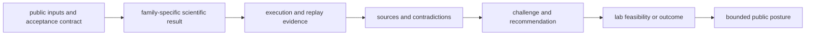

# Workflow families

Proteomics workflows have different inputs, assumptions, failure modes, and
evidence depth. Bijux Proteomics therefore assigns public confidence to each
family separately. Support in one family does not transfer automatically to
another.

## Evidence posture

| Family | Public posture | Primary run mode | Strongest current evidence | Principal limitation |
| --- | --- | --- | --- | --- |
| DDA | outsider-auditable, bounded | `import_only` | public benchmark lineage, reviewed downstream identification and replay evidence | live in-repository search-engine parity remains narrower |
| DIA | outsider-auditable, bounded | `raw_executable` | library-aware benchmark, execution, replay, and comparison records | incomplete libraries and absent-peptide consequences |
| LFQ | review-grade, bounded | `raw_executable` | normalization, missingness, cohort, and quantitative review surfaces | transfer evidence and external-review depth |
| multiplex | internal support | `raw_executable` | substantive runtime and analysis surfaces | public stress evidence does not sustain outsider-facing trust |
| PTM | outsider-auditable, bounded | `raw_executable` | localization, site mapping, site-level review, and consequence-aware records | downstream biological consequence is less certain than localization |
| targeted | outsider-auditable, bounded | `raw_executable` | panel, calibration, interference, transition, and validation-planning records | matrix effects, calibration transfer, interference, and assay burden |

`Raw executable` means the repository can operate the declared lane from its
scientific inputs. `Import only` means the strongest evidence begins with
externally produced results and reviews them under owned contracts. Neither
label is an accuracy grade.

## Family boundaries

### Data-dependent acquisition

DDA support centers on governed search-result intake, PSM normalization,
target-decoy FDR, protein inference, quantification, and downstream review.
Claims must identify whether search execution occurred outside the repository
and preserve search-engine and parameter provenance.

[Inspect DDA benchmark lineage](../../04-bijux-proteomics-core/foundation/dda-benchmark-lineage.md).

### Data-independent acquisition

DIA support includes precursor and protein matrices, library-aware processing,
quantification, replay, and benchmark comparison. Library construction,
coverage, interference, and treatment of missing precursors constrain
cross-study conclusions.

[Inspect DIA benchmark lineage](../../04-bijux-proteomics-core/foundation/dia-benchmark-lineage.md).

### Label-free quantification

LFQ conclusions depend strongly on design, normalization, missingness,
batch structure, aggregation, and contrast policy. A workflow can be
operationally reproducible while remaining sensitive to those analytical
choices.

[Inspect LFQ benchmark lineage](../../04-bijux-proteomics-core/foundation/lfq-benchmark-lineage.md).

### Multiplex quantification

Multiplex models and runtime routes exist, but public trust remains internal.
Channel assignment, pooled-reference strategy, ratio compression,
interference, bridge design, and batch connectivity require stronger public
stress evidence before the posture can widen.

[Inspect multiplex benchmark lineage](../../04-bijux-proteomics-core/foundation/multiplex-benchmark-lineage.md).

### Post-translational modification analysis

PTM support separates modified-peptide evidence, localization, protein-site
mapping, site-level FDR, abundance correction, motifs, occupancy, and
functional interpretation. A confidently localized site is not automatically
a causal or functional result.

[Inspect PTM benchmark lineage](../../04-bijux-proteomics-core/foundation/ptm-benchmark-lineage.md).

### Targeted proteomics

Targeted support covers candidate peptides, transitions, calibration,
interference, assay planning, and discovery-to-validation handoff. Claims must
retain matrix, calibration range, limit, transition, and readiness context.

[Inspect targeted benchmark lineage](../../04-bijux-proteomics-core/foundation/targeted-benchmark-lineage.md).

## How posture is established

The weakest required layer limits the final posture. A strong runtime lane
cannot compensate for weak scientific acceptance criteria; a strong benchmark
cannot compensate for missing provenance; a recommendation cannot compensate
for infeasible validation.

For a full review procedure, use the [scientist journey](scientist-journey.md).
For claims that remain unsupported or bounded, see
[current capability limits](current-capability-limits.md).
