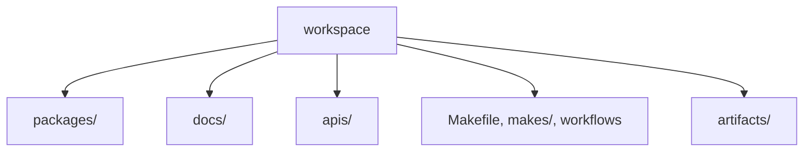

# Workspace Layout

The workspace layout is part of the repository's review model. It separates
product packages, maintainer automation, tracked API artifacts, docs, and root
process surfaces so a reviewer can tell what kind of change is being made
before reading implementation detail.

## Layout Model

This page should make the directory layout feel like a review map. The point is not just where files sit, but what kind of claim a change is making before anyone reads code.

## Layout Layers

- `packages/` for publishable product packages and the maintainer helper package
- `docs/` for the public handbook split that mirrors the architecture
- `apis/` for tracked API and contract artifacts
- `Makefile`, `makes/`, and `.github/workflows/` for repository-wide process
  and automation surfaces
- `artifacts/` for generated local or CI output that is not governed source

## Why Layout Matters

This structure is not just current arrangement. It protects the distinction
between owned source, tracked contracts, public explanation, and generated run
output. When those categories mix, boundary review gets weaker.

## First Proof Check

- the directory layer where a proposed change lands
- the matching handbook branch that should explain that layer

## Design Pressure

The easy failure is to treat layout as neutral storage, which makes it harder to notice when governed source, generated output, and cross-package process start mixing together.
