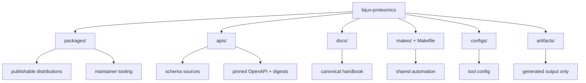

# Workspace Layout

The top-level tree should help readers place work quickly. If the layout makes
ownership harder to see, it is working against the design.

## Top-Level Directories

- `packages/` for publishable Python distributions and maintainer tooling
- `apis/` for checked schema sources, pinned OpenAPI JSON, and digests
- `docs/` for the canonical handbook
- `makes/` and `Makefile` for repository automation
- `configs/` for shared tool configuration
- `artifacts/` for generated validation output

## Layout Rule

A concern should live at the root only when it serves more than one package or
when it explains the workspace itself.

## Purpose

This page explains the top-level directory split that supports the repository
ownership model.

## Stability

Keep it aligned with the real top-level directories and their current meaning.
