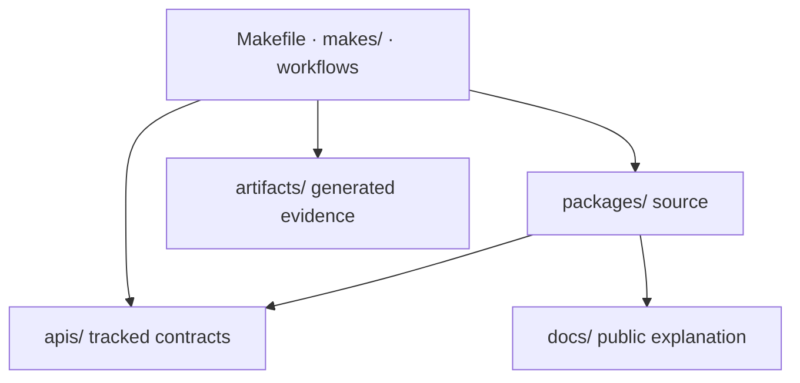

# Workspace layout

Repository directories separate publishable code, public contracts,
documentation, automation, and generated evidence. The location of a change is
therefore part of its ownership and review story.

```text
bijux-proteomics/
├── packages/        publishable packages and repository tooling
├── docs/            public MkDocs source
├── apis/            tracked API contract artifacts
├── configs/         repository-owned tool and governance configuration
├── makes/           composable Make orchestration
├── .github/         CI, release, and repository governance
├── artifacts/       generated local and CI outputs
├── Makefile         root command entrypoint
└── mkdocs.yml       published documentation navigation
```

## Ownership by directory

| Path | Owns | Does not own |
| --- | --- | --- |
| `packages/` | source, tests, metadata, package-local compatibility surfaces | ad hoc generated reports |
| `docs/` | public explanations, guides, references, and governed public dossiers | private planning notes or transient run logs |
| `apis/` | checked OpenAPI and other public machine-readable contracts | runtime-generated copies with no review contract |
| `configs/` | shared lint, type, test, and repository policy configuration | package behavior that belongs in source |
| `makes/` | command composition, package dispatch, checks, builds, and publication wiring | scientific or product policy |
| `.github/` | workflow execution and repository governance entrypoints | duplicate implementations of Make or package logic |
| `artifacts/` | disposable or reproducible outputs from local and CI runs | governed handwritten source |



## Package layout

Canonical packages use a `src/` layout and keep tests inside the corresponding
package directory. Compatibility distributions such as `proteomics-core`
forward to canonical owners and must not gain a second implementation. Package
metadata and changelogs live with the distribution they describe.

The repository root coordinates packages but is not a product package. A rule
belongs at root only when it genuinely spans several packages, such as package
inventory, documentation publication, shared quality dispatch, or coordinated
release validation.

## Generated versus governed files

Generated run products, test reports, builds, coverage, SBOMs, and site output
belong under `artifacts/`. A generated file may live elsewhere only when that
location is itself the governed public contract, such as a checked API schema or
an intentionally published documentation dossier. Such outputs require a
generator and a freshness check; they are not hand-edited as ordinary prose.

When a change crosses directories, review every boundary it claims to connect.
A source change with a contract consequence may require `apis/`, tests, and
public docs. A workflow-only change should not quietly alter scientific meaning.
