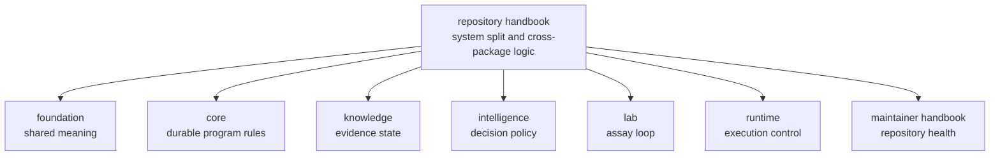

# Repository Handbook

This handbook explains the logic of one bounded proteomics product. It is the
place to answer questions that no single package can answer honestly on its
own: how benchmark assets become execution, review, recommendation, and lab
consequence; which package owns each handoff; and which repository claims are
still blocked.

The root discipline is restraint. The handbook should make the full product
legible, then hand the reader to the true owner before repository prose starts
pretending it owns package-local behavior.

## What This Handbook Does Well

- it shows why the system is layered instead of monolithic
- it names the seams between meaning, rules, evidence, judgment, execution, and
  lab action
- it keeps the reader from blaming the wrong package for the wrong kind of
  change

## Shared Reader Routes

- Open [Product Overview](https://bijux.io/bijux-proteomics/01-bijux-proteomics/foundation/product-overview/)
  when the question is still product-wide rather than repository-handbook
  specific.
- Open [Workflow Families](https://bijux.io/bijux-proteomics/01-bijux-proteomics/foundation/workflow-families/)
  when the reader already knows the question is family credibility rather than
  repository topology.
- Open [Maintenance](https://bijux.io/bijux-proteomics/08-bijux-proteomics-maintain/bijux-proteomics-dev/maintenance-overview/)
  when the question is already about safe change or release validation.

## Start Inside This Handbook

- Open [Product Architecture](https://bijux.io/bijux-proteomics/01-bijux-proteomics/foundation/product-architecture/)
  when the question is how the end-to-end product chain is meant to work.
- Open [Cross-Package Ownership](https://bijux.io/bijux-proteomics/01-bijux-proteomics/foundation/cross-package-ownership/)
  when the question is which package or handoff owns the work.
- Open [Repository Shape Rationale](https://bijux.io/bijux-proteomics/01-bijux-proteomics/foundation/repository-shape-rationale/)
  when the question is why the current package split still exists and which
  split is only compatibility.
- Open [Release Readiness Matrix](https://bijux.io/bijux-proteomics/01-bijux-proteomics/foundation/release-readiness-matrix/)
  when the question is whether public wording outruns checked evidence.
- Open [Operations](https://bijux.io/bijux-proteomics/01-bijux-proteomics/operations/)
  when the question is how the repository validates, releases, and reviews work
  across package boundaries.

## Reader Routes

- Scientist:
  [Scientist Journey](https://bijux.io/bijux-proteomics/01-bijux-proteomics/foundation/scientist-journey/)
- Operator:
  [Operator Rerun Journey](https://bijux.io/bijux-proteomics/09-bijux-proteomics-runtime/operator-rerun-journey/)
- Maintainer:
  [Maintainer Safe Change](https://bijux.io/bijux-proteomics/08-bijux-proteomics-maintain/bijux-proteomics-dev/maintainer-safe-change/)

## Questions This Handbook Owns

- Why is one concern a package boundary while another is only a module?
- Which package should own a disputed behavior?
- Which repository surfaces are truly shared and which are only adjacent?

## Canonical Package Handbooks

- [bijux-proteomics-foundation](https://bijux.io/bijux-proteomics/03-bijux-proteomics-foundation/)
- [bijux-proteomics-core](https://bijux.io/bijux-proteomics/04-bijux-proteomics-core/)
- [bijux-proteomics-intelligence](https://bijux.io/bijux-proteomics/05-bijux-proteomics-intelligence/)
- [bijux-proteomics-knowledge](https://bijux.io/bijux-proteomics/06-bijux-proteomics-knowledge/)
- [bijux-proteomics-lab](https://bijux.io/bijux-proteomics/07-bijux-proteomics-lab/)
- [bijux-proteomics-runtime](https://bijux.io/bijux-proteomics/09-bijux-proteomics-runtime/)

## Compatibility Handbook

- [agentic-proteins](https://bijux.io/bijux-proteomics/02-agentic-proteins/)

## Boundary Test

If the best proof lives mostly in one package source tree, one package test
suite, or one package API contract, the root should hand the reader off instead
of pretending repository prose owns that behavior.
