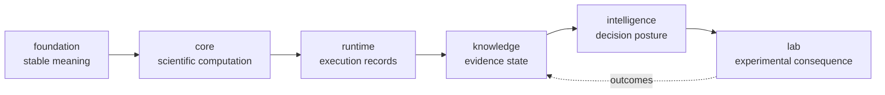

# Repository handbook

Bijux Proteomics is organized as a scientific product family: six canonical
packages own distinct parts of an auditable workflow, one compatibility
package preserves historical execution surfaces, and one development package
owns repository-wide verification.

This handbook describes the boundaries that matter when work crosses packages.
Package handbooks document the local Python APIs and workflows.

## System map

The arrows show the product narrative, not every permitted Python import.
Several packages consume narrow contracts from later stages to assemble
cross-package review artifacts. The governed dependency directions are listed
in [cross-package ownership](foundation/cross-package-ownership.md).

## Product handoffs

| Handoff | Owner | What crosses the boundary |
| --- | --- | --- |
| foundation contract | `bijux-proteomics-foundation` | identifiers, document schemas, canonical JSON, stable hashes, typed outcomes |
| benchmark asset bundle | `bijux-proteomics-core` | scientific inputs, challenge corpora, acceptance criteria, workflow requests |
| runtime run bundle | `bijux-proteomics-runtime` | run manifest, artifact ledger, checkpoints, replay and comparison records |
| scientific review bundle | `bijux-proteomics-knowledge` | grounded claims, provenance, contradiction ledger, evidence sufficiency |
| recommendation record | `bijux-proteomics-intelligence` | ranking, sensitivity, counterfactuals, stance, refusal explanation |
| lab consequence record | `bijux-proteomics-lab` | assay plan, readiness decision, handoff, observation, feedback |

These artifacts preserve different kinds of truth. Execution success cannot
stand in for scientific validity; evidence support cannot stand in for a
decision policy; and a recommendation cannot stand in for an observed lab
outcome.

## Navigate by concern

- [Product architecture](foundation/product-architecture.md) — end-to-end data,
  control, evidence, and feedback flow.
- [Package map](foundation/package-map.md) — install names and repository
  locations.
- [Workflow families](foundation/workflow-families.md) — DDA, DIA, LFQ, PTM,
  targeted, and multiplex evidence posture.
- [Public artifact index](foundation/public-artifact-index.md) — benchmark and
  review artifacts intended for external inspection.
- [Current capability limits](foundation/current-capability-limits.md) — areas
  where implementation or evidence remains bounded.
- [Local development](operations/local-development.md) — root environment and
  common commands.
- [Testing and validation](operations/testing-and-validation.md) — test,
  quality, security, docs, and architecture gates.

## Canonical packages

- [Foundation](../03-bijux-proteomics-foundation/index.md)
- [Core](../04-bijux-proteomics-core/index.md)
- [Runtime](../09-bijux-proteomics-runtime/index.md)
- [Knowledge](../06-bijux-proteomics-knowledge/index.md)
- [Intelligence](../05-bijux-proteomics-intelligence/index.md)
- [Lab](../07-bijux-proteomics-lab/index.md)

Use [agentic-proteins](../02-agentic-proteins/index.md) only for compatibility
with historical runtime imports, commands, or API routes. New execution work
belongs in the runtime package. Repository verification and release operations
live in the [maintainer handbook](../08-bijux-proteomics-maintain/index.md).

## Trust boundaries

The platform intentionally does not claim universal proteomics coverage or
automatic biological truth. Confidence is bounded by the workflow-family
benchmark, recorded execution conditions, source quality, contradiction state,
decision sensitivity, and feasibility of downstream validation. Each package
can refuse work when its part of that chain is under-specified.
