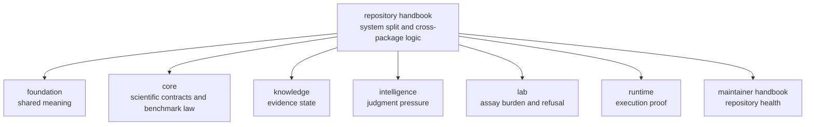

# Repository Handbook

This handbook explains the logic of one bounded proteomics product. It exists
for the questions that no single package can answer honestly on its own:

- how benchmark assets become execution, review, recommendation, and lab
  consequence
- which package owns each handoff in that chain
- where the repository can defend strong wording today and where it still must
  narrow

The root discipline is restraint. This handbook should make the full product
legible, then hand the reader to the true owner before repository prose starts
pretending it owns package-local behavior.

## Why This Handbook Matters More Now

Older repository docs could make `bijux-proteomics` look like package
governance plus utilities. That is no longer honest. The repository now has a
real scientific and operational chain to explain: public benchmark packets,
runtime rerun proof, explicit grounding pressure, measurable recommendation
challenge, and downstream assay consequence.

## Strongest Repository Proof Surfaces

- Open [Flagship Release Candidate](https://bijux.io/bijux-proteomics/01-bijux-proteomics/foundation/flagship-release-candidate/)
  when the question is which workflow-family sentences currently survive public
  scrutiny.
- Open [Public Artifact Index](https://bijux.io/bijux-proteomics/01-bijux-proteomics/foundation/public-artifact-index/)
  when the question is which outsider-facing artifacts should be opened and why
  they coexist.
- Open [Release Readiness Matrix](https://bijux.io/bijux-proteomics/01-bijux-proteomics/foundation/release-readiness-matrix/)
  when the question is whether the current repository language outruns checked
  evidence.
- Open [Hostile Review Kit](https://bijux.io/bijux-proteomics/01-bijux-proteomics/foundation/hostile-review-kit/)
  when the question is how to challenge the strongest current repository claim
  without maintainer narration.

## Shared Reader Routes

- Open [Product Overview](https://bijux.io/bijux-proteomics/01-bijux-proteomics/foundation/product-overview/)
  when the question is still product-wide rather than repository-handbook
  specific.
- Open [Workflow Families](https://bijux.io/bijux-proteomics/01-bijux-proteomics/foundation/workflow-families/)
  when the reader already knows the question is family credibility rather than
  repository topology.
- Open [Maintenance](https://bijux.io/bijux-proteomics/08-bijux-proteomics-maintain/bijux-proteomics-dev/maintenance-overview/)
  when the question is already about safe change, release validation, or
  repository honesty.

## Start Inside This Handbook

- Open [Product Architecture](https://bijux.io/bijux-proteomics/01-bijux-proteomics/foundation/product-architecture/)
  when the question is how benchmark, runtime, knowledge, intelligence, and
  lab consequence are meant to compose.
- Open [Cross-Package Ownership](https://bijux.io/bijux-proteomics/01-bijux-proteomics/foundation/cross-package-ownership/)
  when the question is which package or handoff owns disputed behavior.
- Open [Decision Support](https://bijux.io/bijux-proteomics/01-bijux-proteomics/foundation/decision-support/)
  when the question is which owner currently controls the strongest honest
  public sentence.
- Open [Repository Shape Rationale](https://bijux.io/bijux-proteomics/01-bijux-proteomics/foundation/repository-shape-rationale/)
  when the question is why the package split still exists and which part is
  compatibility versus product substance.
- Open [Operations](https://bijux.io/bijux-proteomics/01-bijux-proteomics/operations/)
  when the question is how the repository validates, releases, and reviews work
  across package boundaries.

## Questions This Handbook Should Settle

- Why is one concern a package boundary while another is only a module?
- Which package should own a disputed behavior or public claim?
- Which repository proof surfaces are truly shared and which are only adjacent?
- Which strong-sounding sentence should narrow because another owner surface
  still refuses it?

## Reader Routes

- Scientist:
  [Scientist Journey](https://bijux.io/bijux-proteomics/01-bijux-proteomics/foundation/scientist-journey/)
- Operator:
  [Operator Rerun Journey](https://bijux.io/bijux-proteomics/09-bijux-proteomics-runtime/operator-rerun-journey/)
- Maintainer:
  [Maintainer Safe Change](https://bijux.io/bijux-proteomics/08-bijux-proteomics-maintain/bijux-proteomics-dev/maintainer-safe-change/)

## Canonical Package Handbooks

- [bijux-proteomics-foundation](https://bijux.io/bijux-proteomics/03-bijux-proteomics-foundation/)
- [bijux-proteomics-core](https://bijux.io/bijux-proteomics/04-bijux-proteomics-core/)
- [bijux-proteomics-intelligence](https://bijux.io/bijux-proteomics/05-bijux-proteomics-intelligence/)
- [bijux-proteomics-knowledge](https://bijux.io/bijux-proteomics/06-bijux-proteomics-knowledge/)
- [bijux-proteomics-lab](https://bijux.io/bijux-proteomics/07-bijux-proteomics-lab/)
- [bijux-proteomics-runtime](https://bijux.io/bijux-proteomics/09-bijux-proteomics-runtime/)

## Compatibility Handbook

- [agentic-proteins](https://bijux.io/bijux-proteomics/02-agentic-proteins/)

## Boundary Test

If the best proof lives mostly in one package source tree, one package test
suite, or one package API contract, this handbook should hand the reader off
instead of pretending repository prose owns that behavior.
