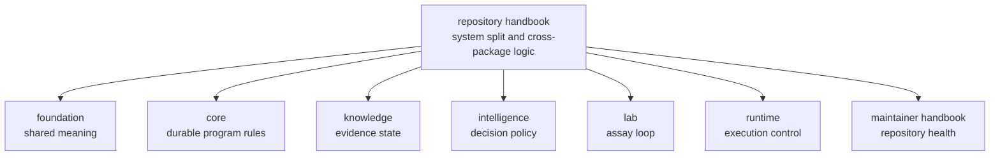

# Repository Handbook

This handbook explains the logic of the split. It is the place to answer
questions that no single package can answer honestly on its own: why the family
exists as multiple packages, which decisions belong above package boundaries,
and where repository authority must stop before it starts flattening the
product into one vague story.

The important discipline here is restraint. A repository root should make the
whole system legible, then hand the reader to the true owner. If it keeps
talking after that point, it becomes noise.

## What This Handbook Does Well

- it shows why the system is layered instead of monolithic
- it names the seams between meaning, rules, evidence, judgment, execution, and
  lab action
- it keeps the reader from blaming the wrong package for the wrong kind of
  change

## Start With

- Open [Foundation](https://bijux.io/bijux-proteomics/01-bijux-proteomics/foundation/)
  when the question is why the split exists and where authority changes hands.
- Open [Scientific Workflow Roadmap](https://bijux.io/bijux-proteomics/01-bijux-proteomics/foundation/scientific-workflow-roadmap/)
  when the question is which scientific workflow capabilities still need to be
  made explicit across package boundaries.
- Open [Operations](https://bijux.io/bijux-proteomics/01-bijux-proteomics/operations/)
  when the question is how the repository validates, releases, and reviews work
  across package boundaries.
- Open the [Maintainer Handbook](https://bijux.io/bijux-proteomics/08-bijux-proteomics-maintain/)
  when the answer lives in helper code, make routing, or GitHub automation.

## Questions This Handbook Owns

- Why is one concern a package boundary while another is only a module?
- Which package should own a disputed behavior?
- Which repository surfaces are truly shared and which are only adjacent?

## Product Handbooks

- [agentic-proteins](https://bijux.io/bijux-proteomics/02-agentic-proteins/)
- [bijux-proteomics-foundation](https://bijux.io/bijux-proteomics/03-bijux-proteomics-foundation/)
- [bijux-proteomics-core](https://bijux.io/bijux-proteomics/04-bijux-proteomics-core/)
- [bijux-proteomics-intelligence](https://bijux.io/bijux-proteomics/05-bijux-proteomics-intelligence/)
- [bijux-proteomics-knowledge](https://bijux.io/bijux-proteomics/06-bijux-proteomics-knowledge/)
- [bijux-proteomics-lab](https://bijux.io/bijux-proteomics/07-bijux-proteomics-lab/)
- [bijux-proteomics-runtime](https://bijux.io/bijux-proteomics/09-bijux-proteomics-runtime/)

## First Proof Check

- `packages/` for the package seams this handbook is describing
- `Makefile` and `makes/` for root-owned command and release routing
- `apis/` and `.github/workflows/` for repository-level contract and validation
  surfaces

## Boundary Test

If the best proof lives mostly in one package source tree, one package test
suite, or one package API contract, the root should hand the reader off instead
of pretending repository prose owns that behavior.
