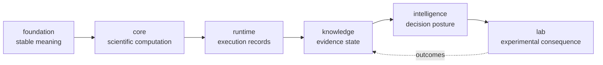
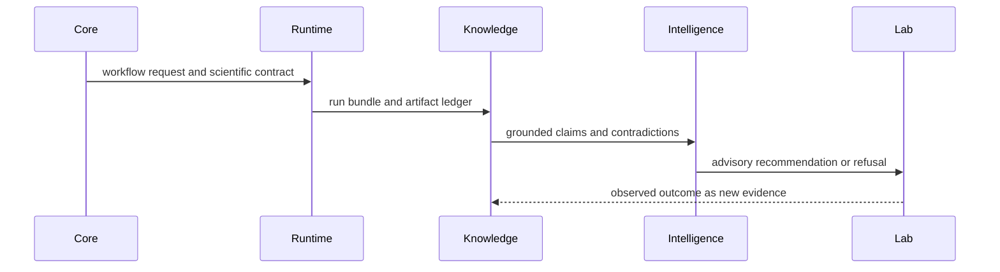

# Repository handbook

Bijux Proteomics is organized as a scientific product family: six canonical
packages own distinct parts of an auditable workflow, one compatibility
package preserves historical execution surfaces, and one development package
owns repository-wide verification.

The repository is designed so a result can cross process and package boundaries
without losing who produced it, what assumptions were active, why it was
accepted, or which later evidence changed its interpretation.

## System map

The arrows show evidence movement, not a Python import graph. Foundation
contracts are consumed across the chain; feedback from Lab appends evidence in
Knowledge without mutating the historical recommendation. Governed dependency
directions are listed in
[cross-package ownership](foundation/cross-package-ownership.md).

## Product handoffs

| Handoff | Owner | What crosses the boundary |
| --- | --- | --- |
| foundation contract | `bijux-proteomics-foundation` | identifiers, document schemas, canonical JSON, stable hashes, typed outcomes |
| benchmark asset bundle | `bijux-proteomics-core` | scientific inputs, challenge corpora, acceptance criteria, workflow requests |
| runtime run bundle | `bijux-proteomics-runtime` | run manifest, artifact ledger, checkpoints, replay and comparison records |
| scientific review bundle | `bijux-proteomics-knowledge` | grounded claims, provenance, contradiction ledger, evidence sufficiency |
| recommendation record | `bijux-proteomics-intelligence` | ranking, sensitivity, counterfactuals, stance, refusal explanation |
| lab consequence record | `bijux-proteomics-lab` | assay plan, readiness decision, handoff, observation, feedback |

These artifacts preserve different kinds of truth. Execution success cannot
stand in for scientific validity; evidence support cannot stand in for a
decision policy; and a recommendation cannot stand in for an observed lab
outcome.

## Boundary-crossing contract

Every durable handoff carries four separable identities:

| Identity | Answers | Failure if absent |
| --- | --- | --- |
| subject | which sample, protein, peptide, claim, candidate, assay, or batch? | records cannot be joined safely |
| content | which canonical payload and digest? | equality and replay become ambiguous |
| provenance | which source, producer, policy, and parent records? | a value survives without its derivation |
| disposition | accepted, rejected, refused, failed, superseded, or observed? | absence is mistaken for success |

Cross-package code passes typed records or stable references. Display text,
filenames, and directory position are views of those records, not identity
systems.

## Follow one result across the system

Use identifiers and artifact references to cross a boundary; do not reconstruct
state from filenames or narrative reports.

| Review question | Artifact to inspect | Evidence that must remain visible |
| --- | --- | --- |
| what scientific input was accepted? | core parse or analysis result | policy, accepted records, rejections, source identity |
| what actually ran? | runtime run bundle | resolved configuration, provider, state transitions, checkpoints, artifact digests |
| why is the result supportable? | knowledge review bundle | sources, contexts, supporting and contradicting evidence, freshness |
| why was this action proposed? | intelligence recommendation record | ranking policy, scenarios, falsifiers, downgrade chain, human-review flag |
| what happened after the decision? | lab consequence record | readiness, instructions, observations, QC, deviations, evidence promotion |

The return arrow creates a new evidence record. It does not retroactively
change the run, claim, or recommendation that preceded the experiment.

## Choose a route

- [Product architecture](foundation/product-architecture.md) — end-to-end data,
  control, evidence, and feedback flow.
- [Package map](foundation/package-map.md) — install names and repository
  locations.
- [Workflow families](foundation/workflow-families.md) — DDA, DIA, LFQ, PTM,
  targeted, and multiplex evidence posture.
- [Public artifact index](foundation/public-artifact-index.md) — benchmark and
  review artifacts intended for external inspection.
- [Current capability limits](foundation/current-capability-limits.md) — areas
  where implementation or evidence remains bounded.
- [Local development](operations/local-development.md) — root environment and
  common commands.
- [Testing and validation](operations/testing-and-validation.md) — test,
  quality, security, docs, and architecture gates.

| If you are trying to… | Begin here | Continue with |
| --- | --- | --- |
| assess scientific coverage | [workflow families](foundation/workflow-families.md) | the relevant Core workflow handbook and its benchmark evidence |
| reproduce a result | [public artifact index](foundation/public-artifact-index.md) | Runtime replay, comparison, and provenance records |
| judge a biological claim | [Knowledge grounding and contradiction guidance](../06-bijux-proteomics-knowledge/index.md) | [Intelligence sensitivity and refusal guidance](../05-bijux-proteomics-intelligence/index.md) |
| take a result into the laboratory | [Intelligence recommendation records](../05-bijux-proteomics-intelligence/index.md) | [Lab readiness, handoff, QC, and outcome capture](../07-bijux-proteomics-lab/index.md) |
| contribute or release a change | [local development](operations/local-development.md) | [testing and validation](operations/testing-and-validation.md) and the maintainer handbook |

## Canonical packages

- [Foundation](../03-bijux-proteomics-foundation/index.md)
- [Core](../04-bijux-proteomics-core/index.md)
- [Runtime](../09-bijux-proteomics-runtime/index.md)
- [Knowledge](../06-bijux-proteomics-knowledge/index.md)
- [Intelligence](../05-bijux-proteomics-intelligence/index.md)
- [Lab](../07-bijux-proteomics-lab/index.md)

Use [agentic-proteins](../02-agentic-proteins/index.md) only for compatibility
with historical runtime imports, commands, or API routes. New execution work
belongs in the runtime package. Repository verification and release operations
live in the [maintainer handbook](../08-bijux-proteomics-maintain/index.md).

## Trust boundaries

The platform intentionally does not claim universal proteomics coverage or
automatic biological truth. Confidence is bounded by the workflow-family
benchmark, recorded execution conditions, source quality, contradiction state,
decision sensitivity, and feasibility of downstream validation. Each package
can refuse work when its part of that chain is under-specified.

| A visible artifact proves… | It does not prove… |
| --- | --- |
| canonical payload equality | source authenticity or biological equivalence |
| completed Runtime execution | scientific acceptance or transfer |
| benchmark acceptance | validity outside the tested family and conditions |
| grounded support | absence of contradiction or authority to act |
| stable recommendation under tested scenarios | feasibility or laboratory value |
| completed assay | generality beyond the recorded controls and batch |

## Review protocol

Before accepting a cross-package conclusion, confirm that:

1. the scientific result retains rejected inputs and its active policy;
2. the execution record identifies configuration, provider, artifacts, and
   terminal state;
3. evidence references resolve to contextual records rather than unsupported
   prose;
4. contradiction, uncertainty, and refusal paths remain present;
5. an advisory recommendation is not represented as laboratory authority;
6. observed outcomes append to, rather than overwrite, the decision history.
