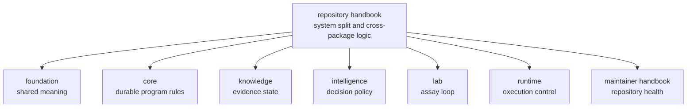

# Repository Handbook

This handbook explains the logic of one bounded proteomics product. It is the
place to answer questions that no single package can answer honestly on its
own: how benchmark assets become execution, review, recommendation, and lab
consequence; which package owns each handoff; and which repository claims are
still blocked.

The root discipline is restraint. The handbook should make the full product
legible, then hand the reader to the true owner before repository prose starts
pretending it owns package-local behavior.

## What This Handbook Does Well

- it shows why the system is layered instead of monolithic
- it names the seams between meaning, rules, evidence, judgment, execution, and
  lab action
- it keeps the reader from blaming the wrong package for the wrong kind of
  change

## Start With

- Open [Product Architecture](https://bijux.io/bijux-proteomics/01-bijux-proteomics/foundation/product-architecture/)
  when the question is how the end-to-end product chain is meant to work.
- Open [Cross-Package Ownership](https://bijux.io/bijux-proteomics/01-bijux-proteomics/foundation/cross-package-ownership/)
  when the question is which package or handoff owns the work.
- Open [Release Readiness Matrix](https://bijux.io/bijux-proteomics/01-bijux-proteomics/foundation/release-readiness-matrix/)
  when the question is whether public wording outruns checked evidence.
- Open [Operations](https://bijux.io/bijux-proteomics/01-bijux-proteomics/operations/)
  when the question is how the repository validates, releases, and reviews work
  across package boundaries.
- Open the [Maintainer Handbook](https://bijux.io/bijux-proteomics/08-bijux-proteomics-maintain/)
  when the answer lives in helper code, make routing, or GitHub automation.

## Reader Routes

- Scientist:
  [Flagship release candidate](https://bijux.io/bijux-proteomics/01-bijux-proteomics/foundation/flagship-release-candidate/)
- Operator:
  [Runtime package handbook](https://bijux.io/bijux-proteomics/09-bijux-proteomics-runtime/)
- Maintainer:
  [Cross-Package Ownership](https://bijux.io/bijux-proteomics/01-bijux-proteomics/foundation/cross-package-ownership/)

## Questions This Handbook Owns

- Why is one concern a package boundary while another is only a module?
- Which package should own a disputed behavior?
- Which repository surfaces are truly shared and which are only adjacent?

## Product Handbooks

- [agentic-proteins](https://bijux.io/bijux-proteomics/02-agentic-proteins/)
- [bijux-proteomics-foundation](https://bijux.io/bijux-proteomics/03-bijux-proteomics-foundation/)
- [bijux-proteomics-core](https://bijux.io/bijux-proteomics/04-bijux-proteomics-core/)
- [bijux-proteomics-intelligence](https://bijux.io/bijux-proteomics/05-bijux-proteomics-intelligence/)
- [bijux-proteomics-knowledge](https://bijux.io/bijux-proteomics/06-bijux-proteomics-knowledge/)
- [bijux-proteomics-lab](https://bijux.io/bijux-proteomics/07-bijux-proteomics-lab/)
- [bijux-proteomics-runtime](https://bijux.io/bijux-proteomics/09-bijux-proteomics-runtime/)

## First Proof Check

- `packages/` for the package seams this handbook is describing
- `Makefile` and `makes/` for root-owned command and release routing
- `apis/` and `.github/workflows/` for repository-level contract and validation
  surfaces

## Boundary Test

If the best proof lives mostly in one package source tree, one package test
suite, or one package API contract, the root should hand the reader off instead
of pretending repository prose owns that behavior.
