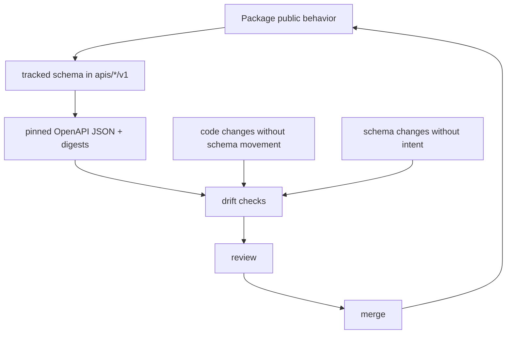

# API and Schema Governance

Shared API artifacts live under `apis/` so contract review does not depend on
reverse-engineering Python modules. Code and tracked schema files should tell
one public story.

## Current Contract Roots

- `apis/agentic-proteins/v1/`
- `apis/bijux-proteomics-foundation/v1/`
- `apis/bijux-proteomics-core/v1/`
- `apis/bijux-proteomics-intelligence/v1/`
- `apis/bijux-proteomics-knowledge/v1/`
- `apis/bijux-proteomics-lab/v1/`

## Governance Rules

- package code and tracked schema files must describe the same public behavior
- pinned OpenAPI JSON and digests move only with reviewable intent
- schema drift checks belong in tooling and tests, not in prose alone

## Purpose

This page explains how repository-level API artifacts stay synchronized with
the code that claims to implement them.

## Stability

Keep it aligned with the real schema roots and drift checks under `apis/` and
`bijux-proteomics-dev`.
