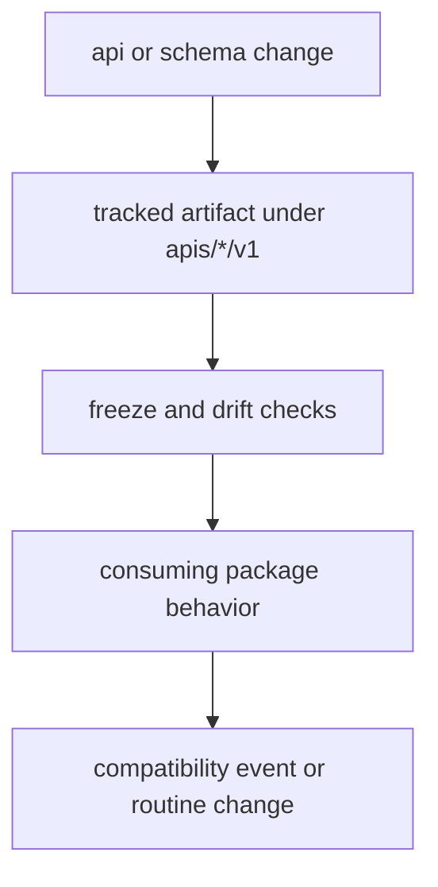

# API and Schema Governance

API and schema governance matters because tracked contracts can drift away from
the code that claims to implement them. The repository owns how those artifacts
are stored, validated, and reviewed across packages.

## Governance Model

This page should make API and schema review feel like contract governance, not file maintenance. If the artifact, the checks, and the behavior do not move together, the repository has already lost the contract story.

## Governing Surfaces

- tracked artifacts under `apis/*/v1`
- freeze and drift checks in `bijux-proteomics-dev`
- workflow and make surfaces that run those checks before release

## Compatibility Threshold

A schema or API change becomes a compatibility event when the tracked artifact,
its contract checks, and the consuming package behavior no longer move together.
At that point the change is no longer bookkeeping and should be reviewed as a
public contract shift.

## First Proof Check

- `apis/*/v1`
- `packages/bijux-proteomics-dev/src/bijux_proteomics_dev/api`
- workflow or make callers that enforce the checks

## Design Pressure

The common drift is to review tracked artifacts as generated output even when they are the public contract surface that should be driving release scrutiny.
