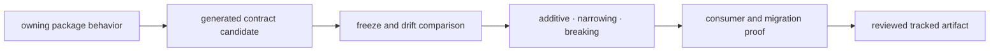

# API and schema governance

Tracked API artifacts under `apis/<package>/v1/` are reviewed public contracts.
They must describe the behavior shipped by the owning package and carry a
versioned route when compatibility is intentionally broken.

## Contract change sequence



Change the owning implementation first. Generate the contract candidate through
the repository command, review its semantic diff, and update the tracked
artifact only when it accurately represents intended behavior. Do not edit a
generated OpenAPI document to make a drift check pass while leaving runtime
behavior unchanged.

## Run the contract gates

```bash
make api-freeze
make openapi-drift
make api
```

- `api-freeze` enforces the governed snapshot contract.
- `openapi-drift` detects breaking schema movement without a corresponding
  version decision.
- `api` runs package API checks for packages registered with API capability.

Use `make api PACKAGE=<package-name>` while working on one package, then run the
repository gates before release.

## Classify compatibility

| Change | Default classification |
| --- | --- |
| new optional response field | additive if old clients may ignore it |
| new required request field | breaking |
| narrower enum, pattern, range, or validation | narrowing or breaking |
| renamed path, operation, field, or error code | breaking |
| changed nullability or default | semantic compatibility event |
| clarification with identical generated schema and behavior | documentation-only |

Schema equality alone cannot prove behavioral compatibility. Validate request
handling, response serialization, status codes, error bodies, and authentication
or authorization behavior where applicable. Conversely, a code change that
alters behavior without moving the tracked artifact is contract drift.

## Canonical and compatibility APIs

The canonical execution API belongs to
`apis/bijux-proteomics-runtime/v1/`. The Agentic Proteins API is a compatibility
mirror and must remain traceable to Runtime rather than becoming a second API
owner. A bridge change requires canonical-schema comparison plus compatibility
route tests.

## Review record

The change description identifies the owning package, affected operations or
schemas, compatibility class, migration route, regenerated files, and commands
run. If a tracked artifact changes without a consumer-visible effect, explain
why the representation moved. If behavior changes without an artifact diff,
explain which non-schema contract moved and how it is tested.
