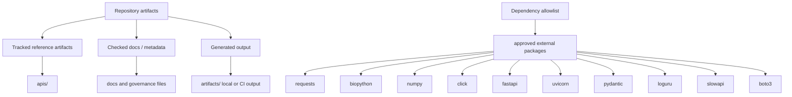

# Artifact Governance

Generated output is useful only when its status is obvious. The repository
needs a clean distinction between canonical source, tracked reference
artifacts, and disposable build output.

## Artifact Classes

- tracked API reference artifacts under `apis/`
- checked documentation and metadata files that participate in repository
  policy
- generated local or CI output under `artifacts/`

## Dependency Allowlist

The dependency allowlist used by `bijux_proteomics_dev.security.dependency_allowlist`
is recorded here so repository policy stays visible.

- requests
- biopython
- numpy
- click
- fastapi
- uvicorn
- pydantic
- loguru
- slowapi
- boto3

## Purpose

This page explains how the repository distinguishes durable reference artifacts
from generated workflow output.

## Stability

Update it when the repository meaning of a tracked artifact class changes.
