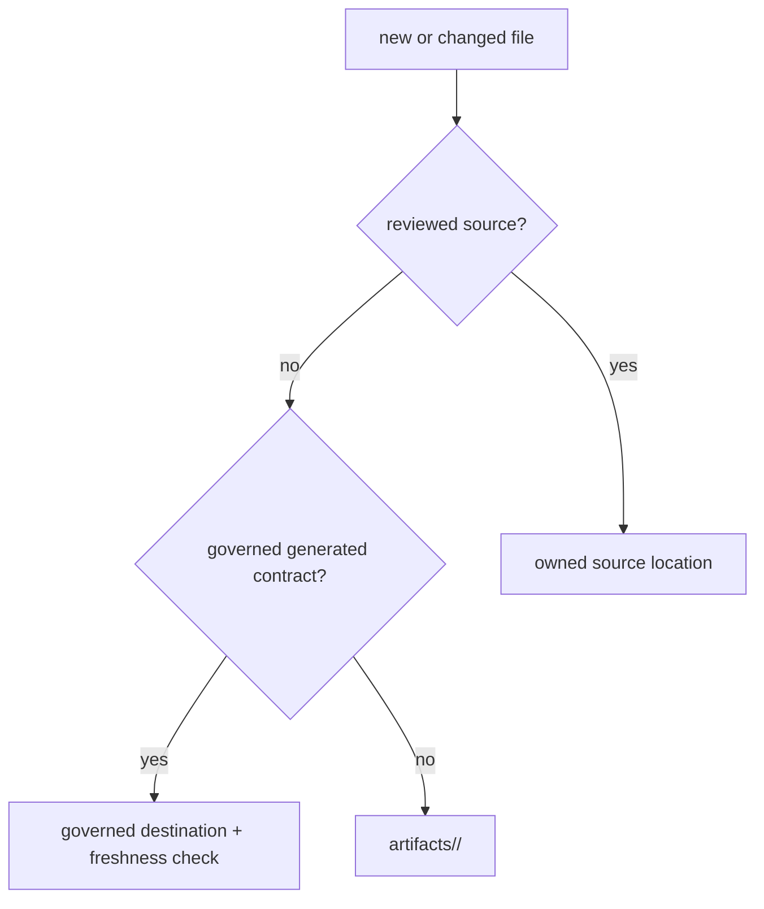

# Artifact governance

Files in the repository fall into three operational classes: governed source,
tracked generated contracts, and transient run output. Classification decides
where a file belongs, who reviews it, and whether it may be regenerated or
deleted.

## Artifact classes

| Class | Examples | Authority | Change rule |
| --- | --- | --- | --- |
| governed source | package code, tests, handwritten docs, configs, Make fragments | owning source and review policy | edit directly and verify affected contracts |
| tracked generated contract | OpenAPI snapshots, generated governance dossiers, checked manifests | generator plus freshness validator | regenerate; do not hand-edit around the generator |
| transient output | wheels, coverage, logs, benchmark runs, local docs site, caches | producing command and recorded provenance | write below `artifacts/`; do not commit as source |

The checked storage matrix is
`configs/package-governance/repository-file-ownership.toml`. It reserves
repository-wide contracts for `apis/`, `configs/`, `docs/`, and `makes/`, keeps
benchmark assets under Core, and routes execution output to `artifacts/`.



## Verify placement

Run the repository artifact gate:

```bash
make quality-artifact-governance
```

It checks package-root hygiene, repository file ownership, and drift against
the governed layout. Use `make clean-root-artifacts` and package clean targets
to remove normal residue; a workflow that repeatedly writes caches, coverage,
`dist/`, `build/`, or site output into publishable package roots needs correction
rather than a recurring manual cleanup.

## Govern generated contracts

A tracked generated file carries both content and derivation. Its generator,
inputs, output path, and freshness check must be discoverable. Review the
semantic diff after regeneration. A clean generated diff does not establish
that the source behavior is correct, and a manually patched artifact does not
repair an incorrect generator.

## Preserve runtime evidence

Transient does not mean meaningless. Runtime bundles, benchmark reports, and
release builds can be strong evidence when they record inputs, versions,
configuration, checksums, and producing commands. Their default storage remains
`artifacts/` because evidence from one run is not automatically the repository's
governed source of truth.

When source, public prose, and run output disagree, stop and identify the
contract owner. Correct the owner, regenerate governed derivatives, and rerun
evidence. Do not choose whichever file supports the preferred conclusion.
