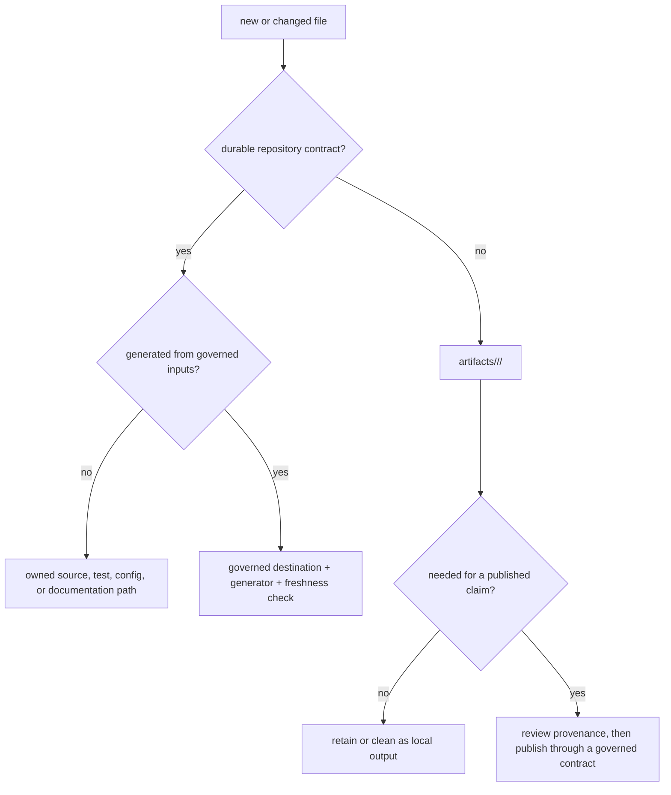

# Artifact governance

Every file carries an authority level as well as a path. Source code and
handwritten documentation are reviewed directly. Generated contracts derive
their authority from a generator and freshness check. Local builds, test runs,
benchmarks, and caches are transient evidence and belong below the repository
`artifacts/` root.

Confusing these classes is dangerous: an untracked run product can look like a
released result, while a hand-edited generated report can disagree with the
source that will replace it on the next regeneration.



## File Ownership Matrix

The checked storage contract is
`configs/package-governance/repository-file-ownership.toml`. The matrix is
generated from the maintainer package and validated by the artifact governance
gate.

| File class | Canonical owner | Typical paths | Review question |
| --- | --- | --- | --- |
| product source and tests | package that owns the behavior | `packages/<package>/src/`, `packages/<package>/tests/` | does the package own the scientific or operational meaning? |
| repository configuration | repository governance | `configs/` | which validator consumes this contract? |
| public API evidence | API governance | `apis/` | which released interface and schema does the snapshot represent? |
| public handbook | repository documentation | `docs/` | does the prose match released behavior and bounded evidence? |
| package-facing explanation | package owner | `packages/<package>/README.md`, package `docs/` | can a consumer understand the package without repository folklore? |
| benchmark source and manifests | `bijux-proteomics-core` | `packages/bijux-proteomics-core/benchmark-assets/` | are provenance, license, corpus identity, and limitations recoverable? |
| execution and verification output | producing run | `artifacts/<owner>/` | are command, environment, inputs, checksums, and terminal status recorded? |

Repository-wide documentation, configuration, API snapshots, and orchestration
remain at the root. Package roots contain package-owned code, tests, metadata,
and package-specific documentation; they are not alternate homes for
repository policy.

## Transient Artifact Policy

Local commands must route disposable or run-specific output under `artifacts/`.
This includes:

- virtual environments, dependency caches, bytecode, and tool caches;
- coverage data, test reports, generated sites, and validation logs;
- wheels, source distributions, and editable-build state;
- benchmark execution bundles, rerun dossiers, and comparison reports;
- temporary exports created while checking schemas or public APIs.

Use a stable owner and a run-specific child path when outputs must coexist:

```text
artifacts/
├── root/                         # repository-wide environments and reports
├── bijux-proteomics-core/        # Core validation output
├── bijux-proteomics-runtime/     # execution and replay output
└── bijux-proteomics-dev/         # governance and documentation checks
```

Clean normal test and build residue with:

```bash
make test-clean
make clean-root-artifacts
```

Cleaning is not a substitute for correct routing. If a command repeatedly
writes `dist/`, `build/`, `site/`, coverage files, caches, or an `artifacts/`
directory into a publishable package root, correct the producing command and
its tests.

## Governed Generated Contracts

A tracked generated contract must have four discoverable properties:

1. the source inputs that determine its content;
2. the command or Python entrypoint that renders it;
3. the canonical checked-in destination;
4. a check mode that fails when source and output disagree.

Regenerate the contract, inspect the semantic diff, and run its freshness
validator. Do not repair drift by editing only the rendered file. A fresh
generated file proves agreement with its generator; it does not independently
prove that the generator expresses the correct policy.

## Prohibited Spillover

The repository rejects storage patterns that create competing authorities:

- no package-local `apis/`, `configs/`, or `makes/` mirrors of root contracts;
- no benchmark roots outside `bijux-proteomics-core`;
- no package-local `artifacts/`, `.venv`, `.pytest_cache`, `.ruff_cache`,
  `.hypothesis`, `coverage.xml`, `htmlcov`, `build`, `dist`, or `site` output;
- no flagship benchmark manifests stored only as transient run products;
- no generated governance page without its source generator and freshness
  check;
- no ad hoc output directory chosen only because a tool defaults there.

Check placement and generated ownership with:

```bash
make quality-artifact-governance
```

The gate validates package-root hygiene, the repository file-ownership matrix,
benchmark ownership, and known generated destinations.

## From Run Output To Public Evidence

Transient does not mean unimportant. A runtime bundle or benchmark report can
support a public claim when it records enough information for independent
inspection:

| Required field | Why it matters |
| --- | --- |
| source revision and package versions | binds the result to executable code |
| input identities and checksums | distinguishes rerun from look-alike data |
| resolved configuration and provider | exposes the actual execution posture |
| command or public entrypoint | gives the reviewer a repeatable opening route |
| artifact inventory and checksums | detects missing or substituted outputs |
| terminal status, refusals, and diagnostics | prevents success-only reporting |
| comparison policy and acceptance result | separates byte equality from scientific acceptance |

Promotion into a published benchmark or release dossier is a governed act. The
reviewed manifest or documentation may cite the run bundle, but the bundle does
not become repository truth merely because a command completed.

When source, public prose, generated contracts, and run output disagree, stop
at the first inconsistent owner. Correct that owner, regenerate its
derivatives, and repeat the evidence-producing command. The preferred
conclusion never decides which file is authoritative.
