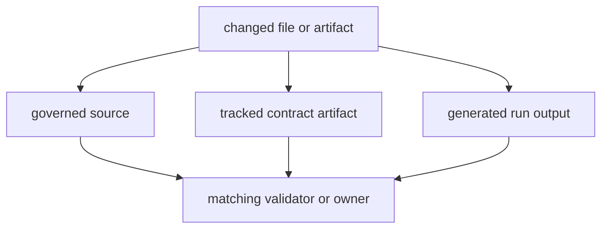

# Artifact Governance

Repository artifacts do not all mean the same thing. Some are governed source,
some are tracked contract references, and some are generated run output. Review
gets weaker when those classes are treated as interchangeable.

## Artifact Model

This page should let a reviewer classify an artifact before debating its meaning. Once file classes blur together, source-of-truth arguments become slow and error-prone.

## Artifact Classes

- governed source under `docs/`, `packages/`, and root config files
- tracked contract artifacts under `apis/`
- generated local or CI output under `artifacts/`

## Authority Rule

When source, docs, and generated output disagree, source plus the governing
contract check wins. Generated output is evidence of a run, not an independent
source of truth.

## First Proof Check

- the file class the artifact belongs to
- the helper, test, or workflow that validates that class

## Design Pressure

The easy failure is to let generated output masquerade as governed source because it happens to live near the files that truly own the behavior.
