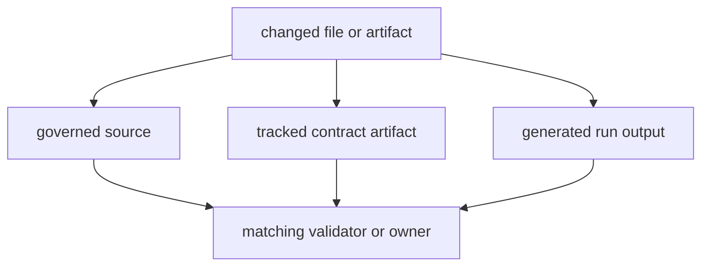

# Artifact Governance

Repository artifacts do not all mean the same thing. Some are governed source,
some are tracked contract references, and some are generated run output. Review
gets weaker when those classes are treated as interchangeable.

## Artifact Model

This page should let a reviewer classify an artifact before debating its meaning. Once file classes blur together, source-of-truth arguments become slow and error-prone.

## Artifact Classes

- governed source under `docs/`, `packages/`, and root config files
- tracked contract artifacts under `apis/`
- generated local or CI output under `artifacts/`

Publishable package roots must stay free of `.pytest_cache`, `.ruff_cache`,
`__pycache__`, coverage spillover, and comparable transient execution state.
If a normal workflow leaves that residue under `packages/*`, the workflow is
wrong even if the code still passes.

## Transient Artifact Policy

- default local outputs, caches, reports, and rerun products to `artifacts/`
- write outside `artifacts/` only when the task intentionally updates a
  governed destination such as `docs/`, `apis/`, or `configs/`
- keep package roots publishable: no `.pytest_cache`, `.ruff_cache`,
  `coverage.xml`, `dist/`, `build/`, `site/`, or similar spillover under
  `packages/*`
- clean local residue through repository entrypoints instead of ad hoc manual
  deletion: `make test-clean`, `make clean-root-artifacts`, and
  `make quality-artifact-governance`

## File Ownership Matrix

The checked storage matrix lives in
`configs/package-governance/repository-file-ownership.toml`.

Use that matrix before introducing a new storage location:

- root contracts and repository-wide docs stay in `apis/`, `configs/`, `docs/`,
  and `makes/`
- package-owned docs stay in package `README.md` files and package-local
  `docs/` roots
- checked benchmark assets stay in
  `packages/bijux-proteomics-core/benchmark-assets/`
- transient outputs stay in `artifacts/`
- maintainer automation stays in `bijux-proteomics-dev` plus root make targets

## Prohibited Spillover

- no package-local `apis/`, `configs/`, or `makes/` mirrors for repository-wide
  governance
- no benchmark roots outside `bijux-proteomics-core`
- no generated local outputs committed or parked under publishable package roots
- no repository-wide policy pages copied into package docs when one root page
  already owns the question

## Authority Rule

When source, docs, and generated output disagree, source plus the governing
contract check wins. Generated output is evidence of a run, not an independent
source of truth.

## First Proof Check

- `configs/package-governance/repository-file-ownership.toml`
- `packages/bijux-proteomics-dev/src/bijux_proteomics_dev/quality/artifacts/repository_file_ownership.py`
- `make quality-artifact-governance`

## Design Pressure

The easy failure is to let generated output masquerade as governed source because it happens to live near the files that truly own the behavior.
