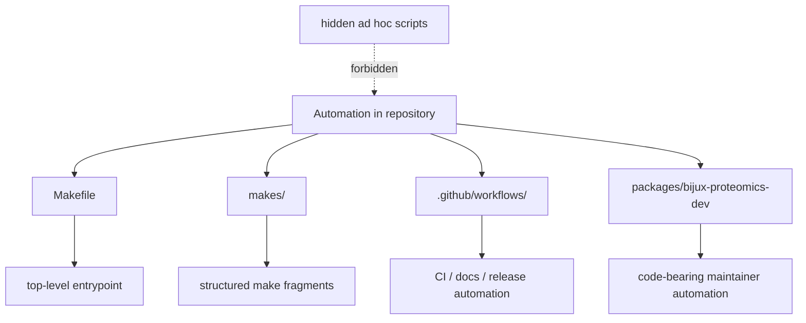

# Automation Surfaces

Repository automation should be visible in named surfaces, not hidden behind
tribal shortcuts.

## Core Automation Surfaces

- `Makefile` as the top-level repository entrypoint
- `makes/` as the structured library of shared make fragments
- `.github/workflows/` as the published CI, docs, and release automation
- `packages/bijux-proteomics-dev` as the code-bearing home for maintainer
  helpers

## Purpose

This page explains where repository automation is allowed to live and how it
should stay reviewable.

## Stability

Keep it aligned with the actual automation surfaces contributors are expected
to use.
