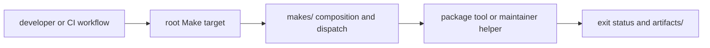

# Automation surfaces

Repository automation has four distinct layers. Workflows select when a check
runs, Make targets define the public command, Make fragments compose package
execution, and `bijux-proteomics-dev` implements policy that benefits from typed
code and tests.

GitHub workflows should call the same stable repository commands used locally.
They provide events, permissions, matrices, caches, and publication context;
they should not reimplement lint, test, schema, or release policy in YAML.

## Choose the right layer

| Need | Owning surface |
| --- | --- |
| expose a stable repository command | `Makefile` or an included root fragment |
| compose several checks or dispatch across packages | `makes/` |
| express package-specific target capability | `makes/packages/<package>.mk` |
| implement structured validation, parsing, or reporting | `bijux-proteomics-dev` |
| decide when and with which permissions a command runs remotely | `.github/workflows/` |
| store local or CI run output | `artifacts/` |

One rule has one implementation owner. A workflow and local Make target may
both expose it, but they must converge on the same helper or package command.

## Trace a command

Start from the invocation shown to users or CI. For a root package gate such as
`make quality`, trace:

1. the target registered in root Make composition;
2. the selected package group in `makes/packages.mk`;
3. each package profile in `makes/packages/`;
4. shared implementation in `makes/bijux-py/`;
5. any typed helper invoked from `bijux-proteomics-dev`;
6. the final output path and exit condition.

Use `make help` for the supported public command inventory. Avoid teaching
callers to invoke deep helper modules when a stable root target exists.

## Review automation changes

Verify local and CI invocations, package selection, environment inputs,
artifact destinations, failure propagation, and cleanup. A composite target
must fail when a required child fails. Package dispatch must report every
failed package rather than stopping in a way that hides the rest of the family.

Changes to workflow permissions, publication, secrets, or shared managed files
receive separate governance review. A passing local helper test does not prove
that the workflow supplies safe permissions or the intended event context.
