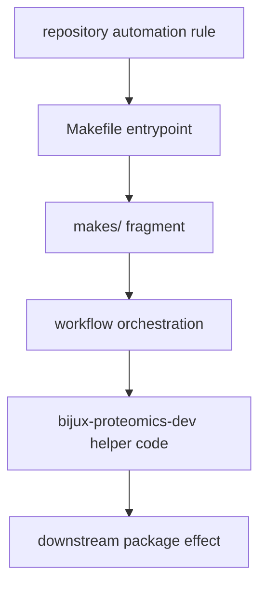

# Automation Surfaces

Repository automation should be visible in named surfaces, not hidden behind
habit. A maintainer should be able to tell whether a rule lives in root make
routing, workflow orchestration, or code-bearing helper logic.

## Automation Model

This page should help a reviewer find the highest-leverage automation surface first. The system becomes much harder to debug when the top-level entrypoint, workflow layer, and helper code are treated like one undifferentiated blob.

## Core Automation Surfaces

- `Makefile` as the top-level entrypoint
- `makes/` as the structured library of shared fragments
- `.github/workflows/` as the published CI, docs, and release automation
- `packages/bijux-proteomics-dev` as the code-bearing home for maintainer
  helpers

## Review Priority

Check automation in the order that failure would spread: top-level workflow or
make entrypoint first, helper code second, and downstream package effects third.
That keeps reviewers focused on the surface that can misroute the whole family.

## First Proof Check

- `Makefile`
- `makes/`
- `.github/workflows/`
- `packages/bijux-proteomics-dev/`

## Design Pressure

The common drift is to look only at helper code while missing that the real misrouting problem started in the entrypoint or workflow layer above it.
