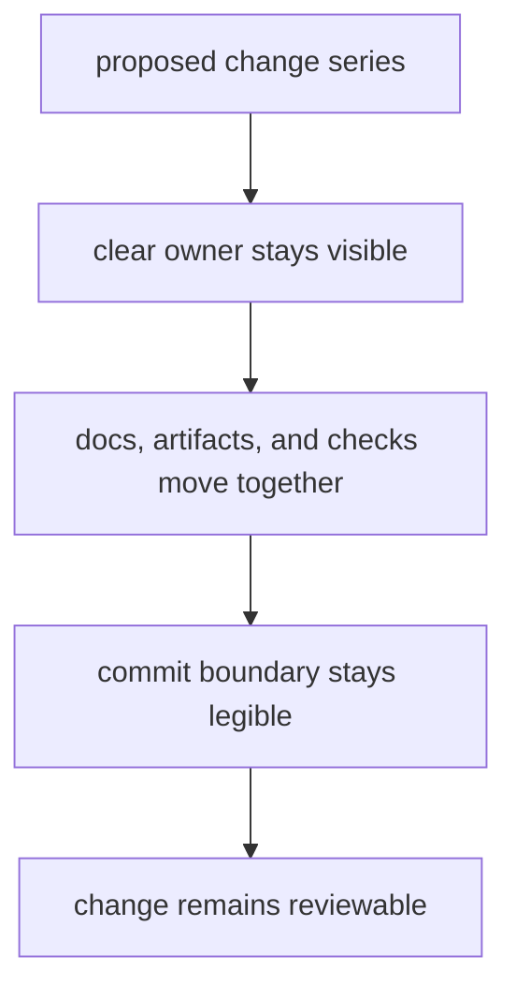

# Change Management

The repository should make change easier to reason about, not easier to hide.
A good change set preserves ownership, keeps proof close, and uses commit
boundaries that remain legible long after the context is gone.

## Change Model

This page should help maintainers judge whether a change series preserves reviewability over time. If one diff makes several unrelated facts move together without a clear owner, the repository is paying future debugging cost immediately.

## Change Rules

- split repository-wide work into reviewable units with durable commit intent
- update the relevant handbook pages in the same change series as behavior
- keep names and paths understandable without private project history
- move redirects, metadata, or tracked contracts together with the behavior
  they explain

## Fast Rejection Gates

- the change has no clear owner
- docs, schema artifacts, and checks are drifting apart
- commit scope is broad enough that one failure hides another

## First Proof Check

- staged diff boundaries before commit
- the matching handbook pages
- the tests, tracked artifacts, or workflow surfaces that prove the change

## Design Pressure

The easy failure is to optimize for short-term throughput and merge a broad, clever change set that no longer tells a durable story commit by commit.
