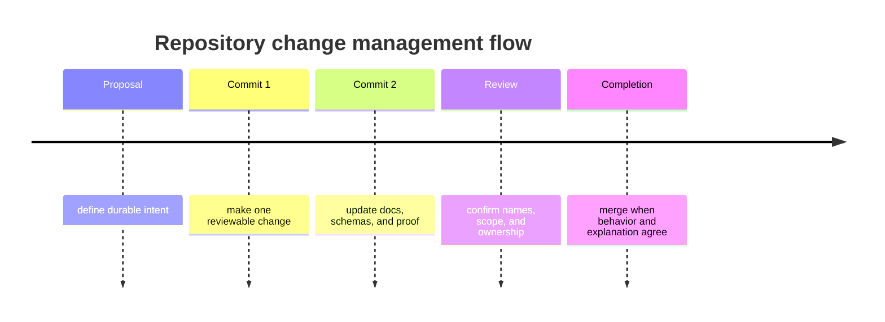

# Change Management

The repository should make change easier to reason about, not easier to hide.

## Expectations

- split repository-wide work into reviewable batches with durable commit intent
- update the relevant handbook pages in the same change series as the behavior
- keep file and directory names descriptive enough that later readers do not
  need private project history to decode them
- use redirects or explicit metadata updates when documentation paths move

## Design Debt Ledger

- no active design debt entries why: repository debt stays empty until a
  constrained exception is explicitly approved exit: keep this section empty
  except approved debt items

## Purpose

This page shows how shared repository changes should be packaged and carried
through to completion.

## Stability

Update it only when the repository’s change discipline genuinely shifts.
