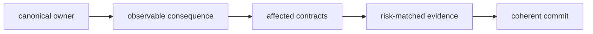

# Change management

Manage repository changes as complete, reviewable intents. The objective is not
the fewest commits or files; it is a history in which ownership, consequence,
and verification remain understandable after the original discussion is gone.

## Build the change from its owner

1. Identify the canonical package or repository surface that owns the meaning.
2. List the public, persisted, compatibility, documentation, and automation
   contracts affected by that owner.
3. Choose evidence for the highest-risk consequence.
4. Implement the smallest coherent unit that leaves those contracts aligned.
5. Run focused checks and inspect both staged and unstaged diffs.
6. Commit the completed intent before beginning an independent one.

## Choose commit boundaries

A boundary exists when one intent is complete and independently reviewable.
Good boundaries include a canonical behavior change, its required migration, a
governed generated refresh, or a self-contained documentation journey. Avoid a
single commit that mixes unrelated package behavior, formatting, dependency
movement, and generated output.

Do not split inseparable correctness work merely to produce smaller diffs. A
schema change and its migration may belong together. A generator correction and
the large regenerated output often deserve separate commits so reviewers can
distinguish handwritten logic from mechanical consequence.

## Preserve compatibility explicitly

For every changed public route, record whether it is preserved, additive,
narrowed, deprecated, or removed. Update compatibility aliases and migration
ledgers only from the canonical owner. Never copy new behavior into a bridge to
avoid coordinating consumers.

## Keep the tree trustworthy

Before committing, confirm generated outputs are in governed destinations,
temporary outputs remain under `artifacts/`, and no unrelated user work is
staged. Use scoped Conventional Commit messages that name the actual surface and
intent. A message such as `docs(governance): define public contract proof`
remains meaningful; delivery-order or generic maintenance labels do not.

## Handoff without concealment

Report exact checks and results. If a relevant repository gate fails for a
pre-existing reason, record the failing package, command, and diagnostics while
still proving the changed surface with focused checks. Do not weaken the gate,
add an exclusion, or describe a partial run as a pass.

The change series is complete when all requested intents are committed, the
worktree is clean, every altered contract has a stated compatibility posture,
and another reviewer can reconstruct why each commit exists from repository
history alone.
