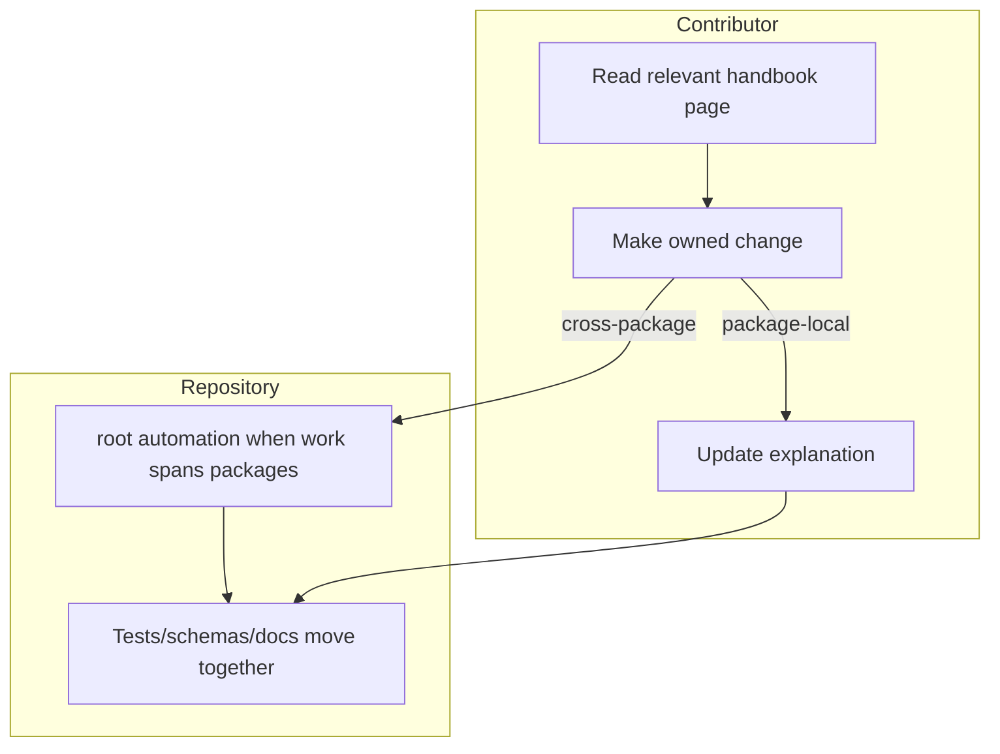

# Contributor Workflows

Contributors should be able to move through the repository in a repeatable
order.

## Common Workflow Shape

- start in the relevant handbook section before editing shared files
- make package-local changes in the owning package when behavior is local
- use root automation when the work spans docs, schemas, release flow, or more
  than one package
- update explanation and proof in the same change series

## Purpose

This page records the normal repository workflow shape so shared work requires
less guesswork.

## Stability

Update it when the checked-in contributor path really changes.
