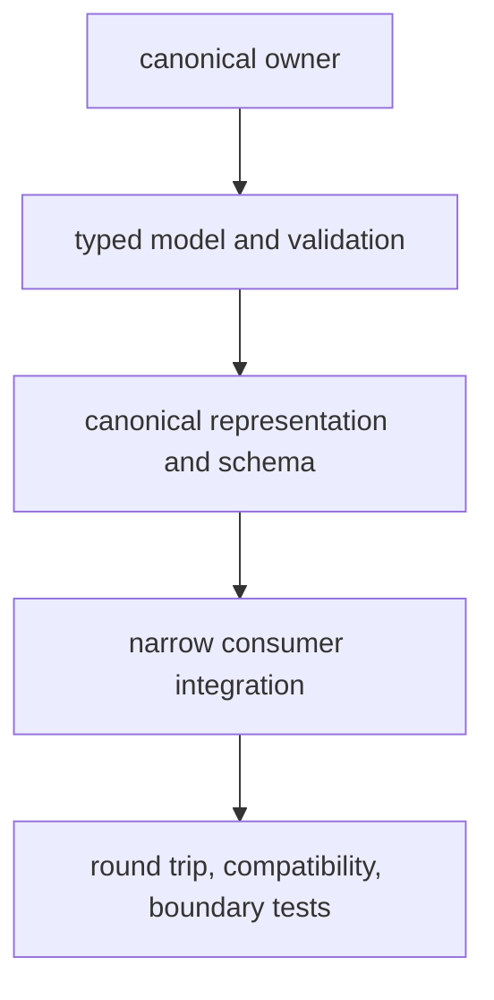

# Contributor workflows

A complete contribution changes one owned behavior, carries its public contract
and proof with it, and leaves generated and unrelated work outside the commit.

## Scientific behavior

For a model, parser, algorithm, policy, or report:

1. identify the scientific owner and its public import surface;
2. write representative valid, invalid, ambiguous, and boundary cases;
3. retain rejections, assumptions, policy, uncertainty, and caveats in the
   returned contract;
4. update the package handbook and executable example;
5. run focused tests, package quality, API checks, and affected cross-package
   integration tests.

Avoid presenting successful execution as scientific validation. New benchmark
claims require governed inputs, lineage, acceptance criteria, and limitations.

## Cross-package contract

When a document or identifier crosses package boundaries:

Change the canonical owner first. Update schema artifacts and compatibility
assessment with the model. Consumers should reference or translate the owned
contract, not duplicate its meaning locally.

Run `make api-freeze`, `make openapi-drift`, public API typing, circular-import,
and architecture checks as applicable.

## Runtime behavior

Runtime changes must preserve the distinction among configuration, scientific
request, execution state, provider decision, artifact, and replay evidence.
Test success, refusal, interruption, resume, integrity failure, and replay
comparison when those states are reachable.

Compatibility work must update the canonical implementation and the migration
ledger together. Historical routes forward to runtime; they do not acquire new
behavior.

## Documentation

Public pages speak directly to scientists, operators, integrators, and
contributors. Do not include planning notes, delivery history, editorial
instructions, or claims about what a page ought to become. Ground examples in
real imports and commands, state limitations next to the relevant capability,
and use diagrams where ownership or state movement is otherwise difficult to
understand.

Validate links, consistency, and a strict MkDocs build. Execute code examples
when they describe package behavior.

## Release-facing change

For dependencies, versioning, workflows, package metadata, or publication:

1. validate the lock and package metadata;
2. run tests, quality, security, API, and build checks for every affected
   distribution;
3. inspect wheel and source distribution contents;
4. validate generated governance and documentation state;
5. run `make release-preflight` without bypassing a failing stage.

## Commit boundary

A commit is ready when its intent is complete, its affected checks have passed
or have an exact recorded blocker, and its staged diff contains only the owned
change. Use scoped Conventional Commit subjects that describe the durable
surface and result. Keep generated synchronization separate from handwritten
behavior unless correctness requires them to move together.
