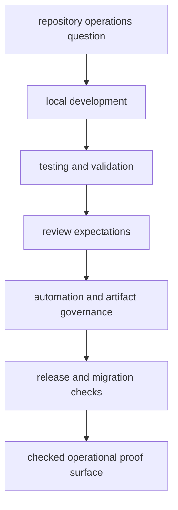

# Operations

The operations section covers repository work that sits above one package:
setup that spans several surfaces, shared validation, release coordination,
review discipline, and runtime migration checks. It should help a maintainer
find the governing process without blurring package-local behavior into root
process prose.

This section should move a maintainer from an operational question to the exact proof surface that governs it. If it only lists topics, it leaves readers to reconstruct the workflow themselves.

## What This Section Is Really About

- how repository-wide work becomes trustworthy enough to publish
- how local proof, CI proof, and release proof connect instead of competing
- where migration validation becomes a first-class operational concern rather
  than a forgotten appendix

## Start With

- Open [Local Development](https://bijux.io/bijux-proteomics/01-bijux-proteomics/operations/local-development/)
  when the first question is how to make and validate a change locally.
- Open [Testing and Validation](https://bijux.io/bijux-proteomics/01-bijux-proteomics/operations/testing-and-validation/)
  when the question is which checks prove which change class.
- Open [Release and Versioning](https://bijux.io/bijux-proteomics/01-bijux-proteomics/operations/release-and-versioning/)
  when the concern is publishable output, tags, or compatibility-sensitive
  version movement.
- Open [Runtime Migration Validation](https://bijux.io/bijux-proteomics/01-bijux-proteomics/operations/runtime-migration-validation/)
  when runtime migration proof is the release blocker.

## Section Pages

- [Local Development](https://bijux.io/bijux-proteomics/01-bijux-proteomics/operations/local-development/)
- [Testing and Validation](https://bijux.io/bijux-proteomics/01-bijux-proteomics/operations/testing-and-validation/)
- [Release and Versioning](https://bijux.io/bijux-proteomics/01-bijux-proteomics/operations/release-and-versioning/)
- [API and Schema Governance](https://bijux.io/bijux-proteomics/01-bijux-proteomics/operations/api-and-schema-governance/)
- [Runtime Migration Validation](https://bijux.io/bijux-proteomics/01-bijux-proteomics/operations/runtime-migration-validation/)
- [Contributor Workflows](https://bijux.io/bijux-proteomics/01-bijux-proteomics/operations/contributor-workflows/)
- [Automation Surfaces](https://bijux.io/bijux-proteomics/01-bijux-proteomics/operations/automation-surfaces/)
- [Artifact Governance](https://bijux.io/bijux-proteomics/01-bijux-proteomics/operations/artifact-governance/)
- [Review Expectations](https://bijux.io/bijux-proteomics/01-bijux-proteomics/operations/review-expectations/)
- [Change Management](https://bijux.io/bijux-proteomics/01-bijux-proteomics/operations/change-management/)

## What This Section Settles

- which repository process owns a given proof obligation
- which checks belong before release-sensitive work can move forward
- when migration pressure changes the normal release and validation story

## First Proof Check

- `Makefile` and `makes/` for root command routing
- `.github/workflows/` for shared automation and release orchestration
- `packages/bijux-proteomics-dev/` when helper code carries the operational
  rule

## Design Pressure

The easy failure is to let repository operations read like a loose catalog instead of a governed sequence from local work to publishable proof.

## Boundary

If a package handbook can explain the workflow honestly from package-local
commands, tests, and contracts, the repository operations section should not try
to own it.
