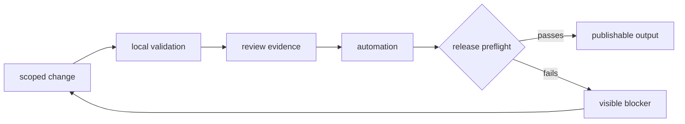
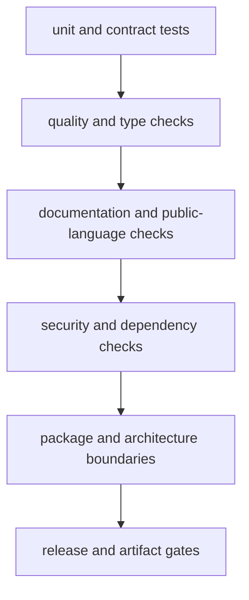
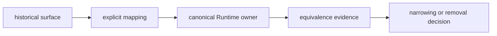

# Repository operations

Repository operations connect a local change to reviewable evidence and, when
appropriate, a publishable package family. They cover the controls shared by
multiple packages: environment setup, test selection, API and schema governance,
artifact custody, automation, compatibility migration, and release proof.

A passing unit test is one layer of evidence. It does not replace architecture,
documentation, security, package-boundary, migration, or publication checks.

## Operating routes

| Work | Begin with | Required evidence |
| --- | --- | --- |
| prepare a contributor environment | [Local development](local-development.md) | supported interpreter, root environment, successful narrow check |
| change one package | [Package contributor onboarding](package-contributor-onboarding.md) | package tests plus affected repository contracts |
| choose validation depth | [Testing and validation](testing-and-validation.md) | named gates matched to the changed surface |
| change a public model or endpoint | [API and schema governance](api-and-schema-governance.md) | compatibility diff, schema evidence, consumer impact |
| add or regenerate evidence | [Artifact governance](artifact-governance.md) | provenance, deterministic location, validation, retention decision |
| alter automation | [Automation surfaces](automation-surfaces.md) | local equivalent, workflow ownership, failure visibility |
| migrate historical runtime users | [Runtime Migration Validation](runtime-migration-validation.md) | import, CLI, route, configuration, replay, and sunset evidence |
| prepare a release | [Release and versioning](release-and-versioning.md) | package identity, build, install, documentation, and preflight results |

## Validation is layered

Run the narrowest check that can expose an error while developing, then expand
to every gate affected by the change. A docs-only change still requires link,
navigation, build, and public-language validation. A model move additionally
requires public API, schema, import, and package-boundary checks. A release
candidate requires the entire preflight, including negative paths.

The root `Makefile` is the command entry point. `makes/` owns command routing,
while `packages/bijux-proteomics-dev/` supplies checked validation logic. CI is
the independent execution environment, not the first place a contributor
discovers whether a change is coherent.

## Evidence custody

Generated output belongs in the repository `artifacts/` tree unless a governed
workflow explicitly refreshes a published location. Each retained artifact
needs enough context to answer:

- which command and source revision produced it;
- which configuration, dependency set, and input identities were active;
- whether it is authoritative, diagnostic, or disposable;
- which validator accepted it and which limitations remain;
- whether a later run supersedes it without erasing historical evidence.

Artifact names and directories describe stable responsibility, not the order in
which work happened. See [artifact governance](artifact-governance.md) for the
full custody and hygiene rules.

## Compatibility-sensitive changes

Runtime compatibility spans more than Python imports. Historical users may
depend on command names, HTTP routes, configuration keys, serialized records,
checkpoint formats, or replay behavior. The migration ledger therefore tracks
each surface separately.

Absence of a failing test is not migration proof. The
[runtime migration validation](runtime-migration-validation.md) guide defines
the required comparisons and the conditions for narrowing or removing a
compatibility surface.

## Review and release controls

- [Contributor workflows](contributor-workflows.md) covers change preparation,
  selective validation, and coherent commits.
- [Review expectations](review-expectations.md) defines the evidence a reviewer
  needs for scientific, contract, and operational claims.
- [Change management](change-management.md) covers ownership, compatibility,
  deprecation, and cross-package coordination.
- [Release and versioning](release-and-versioning.md) connects version movement
  to built distributions, installation proof, documentation truth, and release
  evidence.

A failed gate remains a named blocker. Narrowing the release claim is valid;
silencing, excluding, or relabeling the failure is not.
