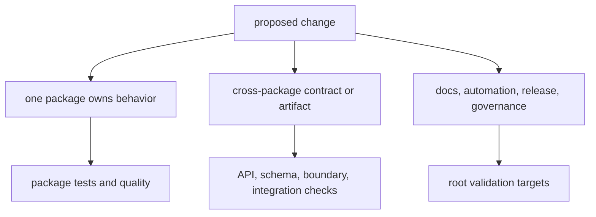

# Local development

The repository is a Python workspace containing independently published
packages. Work from the repository root when a change crosses packages or
governed artifacts; work from the owning package when the behavior and checks
are package-local.

## Prepare the workspace

Python 3.11 or newer is required. From the repository root:

```bash
make ensure-venv
make check-config-layout
make check-make-layout
```

`make ensure-venv` synchronizes the shared root check environment. Generated
logs, reports, build products, and test output are written below `artifacts/`.
Do not place run output in package source trees.

Use `make help` as the command inventory. Make targets are the supported
repository interface; invoking individual tools is useful for diagnosis but
does not replace a governed target when one exists.

## Find the owning surface



Choose ownership by meaning:

- stable identifiers, representation, and compatibility: foundation;
- scientific models, algorithms, formats, and benchmark contracts: core;
- configuration, providers, state, persistence, replay, CLI, and HTTP: runtime;
- sources, evidence, grounding, and reconciliation: knowledge;
- ranking, challenge, recommendation, and refusal: intelligence;
- assay design, readiness, handoff, observation, and feedback: lab;
- historical execution forwarding: agentic-proteins;
- repository checks and release support: bijux-proteomics-dev.

## Development loop

1. Read the owning package handbook and public API before editing.
2. Add or update the smallest test that expresses the changed contract.
3. Implement the behavior without bypassing validation or optional-dependency
   guards.
4. Update public documentation and tracked API/schema artifacts when the
   contract changes.
5. Run focused tests, then the matching package quality and API checks.
6. Escalate to boundary and root checks when another package or repository
   surface is affected.
7. Inspect generated artifacts and the complete diff before committing.

## Useful root commands

| Command | Purpose |
| --- | --- |
| `make test` | primary package test matrix |
| `make lint` | repository lint checks |
| `make quality` | typing, quality, docs, and architecture checks |
| `make security` | static and dependency security gates |
| `make api` | package API contract checks |
| `make docs-check` | strict documentation build without root pollution |
| `make test-collection-gate` | package import and pytest collection check |
| `make architecture-check` | architecture documentation and design-debt guards |
| `make check` | complete repository verification flow |

`make check` also validates the lock, builds distributions, and creates SBOM
artifacts. Use it before release-sensitive changes rather than as the first
feedback loop for a local edit.

## Clean state

`make clean` removes repository artifacts and root environments. Use the
narrower package or artifact cleanup target when only one generated surface
needs removal. Before handing off a change, confirm that source directories are
free of caches and generated run products and that all intentional generated
artifacts are under their governed destination.
