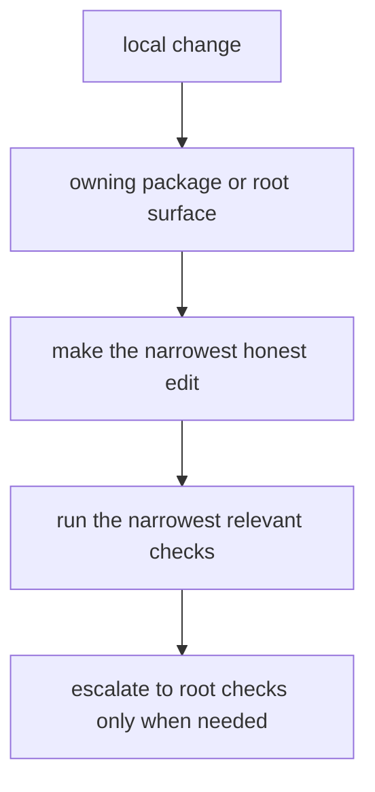

# Local Development

Local work should start in the owning package and escalate to root automation
only when the change genuinely crosses package, schema, or repository
boundaries.

## Development Model

This page should keep local development honest about scope. The fastest loop is not the one with the fewest commands; it is the one that proves the right owner first and only escalates when the change truly crosses boundaries.

## Fastest Honest Loop

1. identify the owning handbook and package first
2. make the change in the narrowest owning surface
3. update docs, schema artifacts, or metadata in the same change when they move
   with the behavior
4. run the narrowest package checks first, then root checks only when the change
   crosses boundaries

## Shared Inputs

- `pyproject.toml` for workspace metadata and commit conventions
- `tox.ini` for root validation environments
- `Makefile` and `makes/` for shared workflows

## First Proof Check

- the owning package tests
- root validation commands only when the change affects shared docs, `apis/`,
  workflows, or release routing

## Design Pressure

The easy failure is to jump straight to root commands and lose the signal about whether the change ever belonged in a narrower surface.
