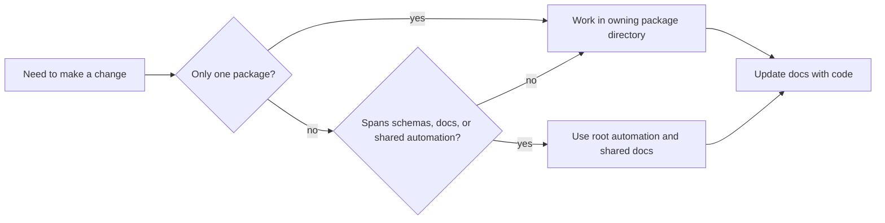

# Local Development

Local work should begin in the owning package and escalate to root automation
only when the change genuinely crosses package, schema, or repository
boundaries.

## Working Rules

- make package-local changes in the owning package directory
- use root automation when the change spans packages, schemas, or shared docs
- keep documentation updates reviewable alongside the code that changes
  behavior

## Shared Inputs

- `pyproject.toml` for workspace metadata and commit conventions
- `tox.ini` for root validation environments
- `Makefile` and `makes/` for common workflows

## Purpose

This page records the preferred development posture for the workspace.

## Stability

Keep it aligned with the root automation files and workflow expectations that
actually exist.
