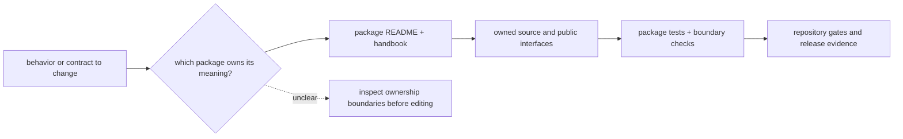
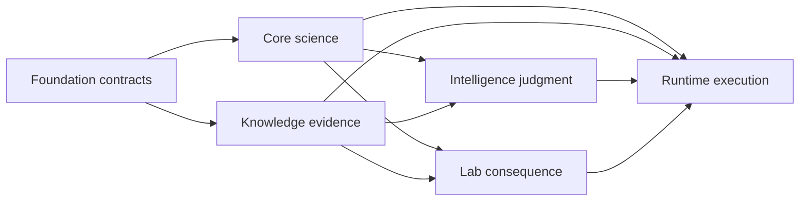

# Package Contributor Onboarding

A safe change begins by locating the package that owns the behavior, the contracts it consumes, and the evidence that can prove the change. The repository contains canonical product packages, compatibility distributions, and maintainer automation; similar names do not imply shared ownership.

## Establish Ownership

1. state the user-visible or scientific behavior that will change;
2. read the repository handbook and the candidate package `README.md`;
3. open the package handbook, source tree, and tests before choosing an implementation seam;
4. inspect direct workspace dependencies and confirm their direction will remain valid;
5. identify the narrow package checks and repository gates that prove the change.

Do not choose an owner from an import name alone. Alias distributions can forward to a canonical package, Runtime can execute a Core contract without owning its scientific meaning, and Intelligence can consume Knowledge evidence without owning its history.

## Package Map

| package | distribution | import root | direct workspace dependencies | read first | tests | docs |
| --- | --- | --- | --- | --- | --- | --- |
| `agentic-proteins` | `agentic-proteins` | `agentic_proteins` | `bijux-proteomics-core`, `bijux-proteomics-runtime` | `packages/agentic-proteins/README.md` | `packages/agentic-proteins/tests` | `docs/02-agentic-proteins` |
| `bijux-proteomics-dev` | `bijux-proteomics-dev` | `bijux_proteomics_dev` | `agentic-proteins` | `packages/bijux-proteomics-dev/README.md` | `packages/bijux-proteomics-dev/tests` | `docs/08-bijux-proteomics-maintain/bijux-proteomics-dev` |
| `bijux-proteomics-foundation` | `bijux-proteomics-foundation` | `bijux_proteomics_foundation` | _none_ | `packages/bijux-proteomics-foundation/README.md` | `packages/bijux-proteomics-foundation/tests` | `docs/03-bijux-proteomics-foundation` |
| `bijux-proteomics-core` | `bijux-proteomics-core` | `bijux_proteomics` | `bijux-proteomics-foundation` | `packages/bijux-proteomics-core/README.md` | `packages/bijux-proteomics-core/tests` | `docs/04-bijux-proteomics-core` |
| `bijux-proteomics-runtime` | `bijux-proteomics-runtime` | `bijux_proteomics_runtime` | `bijux-proteomics-core`, `bijux-proteomics-foundation`, `bijux-proteomics-intelligence`, `bijux-proteomics-knowledge`, `bijux-proteomics-lab` | `packages/bijux-proteomics-runtime/README.md` | `packages/bijux-proteomics-runtime/tests` | `docs/09-bijux-proteomics-runtime` |
| `bijux-proteomics-intelligence` | `bijux-proteomics-intelligence` | `bijux_proteomics_intelligence` | `bijux-proteomics-core`, `bijux-proteomics-foundation`, `bijux-proteomics-knowledge` | `packages/bijux-proteomics-intelligence/README.md` | `packages/bijux-proteomics-intelligence/tests` | `docs/05-bijux-proteomics-intelligence` |
| `bijux-proteomics-knowledge` | `bijux-proteomics-knowledge` | `bijux_proteomics_knowledge` | `bijux-proteomics-core`, `bijux-proteomics-foundation` | `packages/bijux-proteomics-knowledge/README.md` | `packages/bijux-proteomics-knowledge/tests` | `docs/06-bijux-proteomics-knowledge` |
| `bijux-proteomics-lab` | `bijux-proteomics-lab` | `bijux_proteomics_lab` | `bijux-proteomics-core`, `bijux-proteomics-foundation`, `bijux-proteomics-knowledge` | `packages/bijux-proteomics-lab/README.md` | `packages/bijux-proteomics-lab/tests` | `docs/07-bijux-proteomics-lab` |
| `bijux-proteomics` | `bijux-proteomics` | `bijux_proteomics_alias` | `bijux-proteomics-core` | `packages/bijux-proteomics/README.md` | `packages/bijux-proteomics/tests` | `docs/01-bijux-proteomics` |
| `proteomics` | `proteomics` | `proteomics` | `bijux-proteomics-core`, `bijux-proteomics-foundation` | `packages/proteomics/README.md` | `packages/proteomics/tests` | `docs/01-bijux-proteomics` |
| `proteomics-core` | `proteomics-core` | `proteomics_core` | `bijux-proteomics-core`, `bijux-proteomics-foundation` | `packages/proteomics-core/README.md` | `packages/proteomics-core/tests` | `docs/04-bijux-proteomics-core` |
| `proteomics-foundation` | `proteomics-foundation` | `proteomics_foundation` | `bijux-proteomics-foundation` | `packages/proteomics-foundation/README.md` | `packages/proteomics-foundation/tests` | `docs/03-bijux-proteomics-foundation` |
| `proteomics-runtime` | `proteomics-runtime` | `proteomics_runtime` | `bijux-proteomics-foundation`, `bijux-proteomics-runtime` | `packages/proteomics-runtime/README.md` | `packages/proteomics-runtime/tests` | `docs/09-bijux-proteomics-runtime` |
| `proteomics-intelligence` | `proteomics-intelligence` | `proteomics_intelligence` | `bijux-proteomics-foundation`, `bijux-proteomics-intelligence` | `packages/proteomics-intelligence/README.md` | `packages/proteomics-intelligence/tests` | `docs/05-bijux-proteomics-intelligence` |
| `proteomics-knowledge` | `proteomics-knowledge` | `proteomics_knowledge` | `bijux-proteomics-foundation`, `bijux-proteomics-knowledge` | `packages/proteomics-knowledge/README.md` | `packages/proteomics-knowledge/tests` | `docs/06-bijux-proteomics-knowledge` |
| `proteomics-lab` | `proteomics-lab` | `proteomics_lab` | `bijux-proteomics-foundation`, `bijux-proteomics-lab` | `packages/proteomics-lab/README.md` | `packages/proteomics-lab/tests` | `docs/07-bijux-proteomics-lab` |

## Dependency Direction

Foundation owns portable identifiers, schemas, serialization, and typed outcomes. Core adds proteomics meaning. Knowledge adds evidence custody. Intelligence adds advisory judgment. Lab adds operational consequence. Runtime may integrate those packages to execute a request, but that dependency breadth does not transfer their authority to Runtime.

An import that points against these meanings needs an explicit boundary review. Do not solve a circular dependency by moving domain behavior into Foundation or a compatibility package.

## Choose The Maintained Surface

| Change concern | Canonical owner | First proof |
| --- | --- | --- |
| identifiers, schemas, serialization, typed outcomes | `bijux-proteomics-foundation` | contract and schema tests |
| proteomics algorithms, workflow meaning, QC, benchmark acceptance | `bijux-proteomics-core` | scientific tests and benchmark evidence |
| evidence records, grounding, contradiction, reconciliation | `bijux-proteomics-knowledge` | provenance and graph-integrity tests |
| ranking, challenge, downgrade, recommendation, refusal | `bijux-proteomics-intelligence` | decision and calibration tests |
| assay planning, readiness, handoff, observation | `bijux-proteomics-lab` | readiness, control, and outcome tests |
| provider selection, run state, artifacts, replay | `bijux-proteomics-runtime` | execution and replay tests |
| repository governance, docs integrity, release validation | `bijux-proteomics-dev` | targeted governance check |
| historical imports, commands, and routes | compatibility distribution | parity test against canonical owner |

Treat `agentic-proteins`, `bijux-proteomics`, and the `proteomics-*` distributions as compatibility commitments. Preserve or deliberately retire their observable behavior; do not place new product ownership there.

## Prove The Change

Before committing, a reviewer should be able to answer:

- which package owns the changed meaning and which packages only consume it?
- which public import, CLI, schema, artifact, or documentation contract changed?
- which tests cover success, refusal, malformed input, and boundary behavior?
- which generated outputs were refreshed from their owning source?
- which benchmark or run evidence supports any widened scientific claim?
- which known limitation remains after the change?

Use [Testing and Validation](testing-and-validation.md) to select repository gates, [Artifact Governance](artifact-governance.md) for output placement, and [Maintainer Safe Change](../../08-bijux-proteomics-maintain/bijux-proteomics-dev/maintainer-safe-change.md) for the complete review path.
