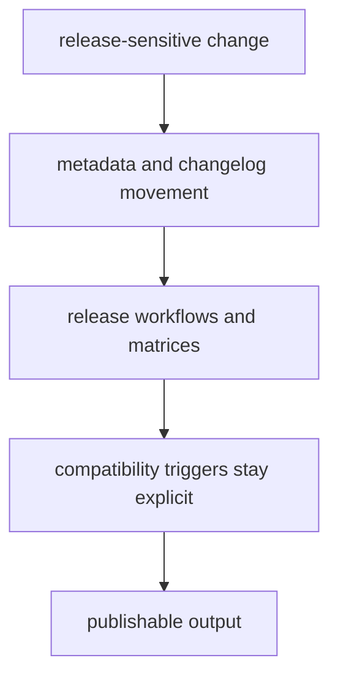

# Release and Versioning

Release discipline matters most where several publishable packages move
together. In this repository, versioning should make compatibility-sensitive
change visible rather than hide it behind generic release automation.

## Release Model

This page should make release work feel like compatibility communication, not just publication mechanics. If version movement hides what changed for readers or consumers, the release process is already under-explaining the risk.

## Shared Release Facts

- root commit rules live in `pyproject.toml`
- the release version is explicit in Git history because version is resolved from Git tags through `hatch-vcs`
- release workflows coordinate build through `release-artifacts.yml`, PyPI
  publication through `release-pypi.yml`, GHCR publication through
  `release-ghcr.yml`, and GitHub release output through `release-github.yml`
- each publishable package owns its own `CHANGELOG.md`

## Compatibility Triggers

Treat a release as repository-significant when it changes tracked API
artifacts, runtime migration posture, package routing, or another surface that
several packages or external consumers depend on together.

## First Proof Check

- package metadata and changelogs
- release workflows under `.github/workflows/`
- publication guard and version resolver helpers in `bijux-proteomics-dev`

## Design Pressure

The common failure is to let shared release automation make several package moves look routine when one of them is actually a compatibility event.
