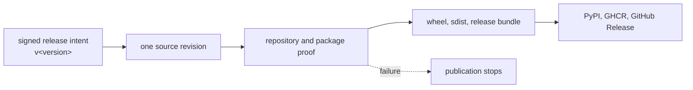

# Release and Versioning

Bijux Proteomics is a coordinated package family. A release is therefore more
than a collection of distributions: it is a claim that package metadata,
compatibility boundaries, scientific evidence, and published artifacts describe
the same repository state.

## One Version, Several Publication Channels

Package versions are resolved from Git through `hatch-vcs`. Release tags use the
`v<version>` form, and each publishable package records its user-visible changes
in its own `CHANGELOG.md`. That combination gives a consumer two complementary
views: the tag identifies the source state; the package changelog explains what
changed at that boundary.



The four release workflows have distinct ownership:

| Workflow | Responsibility |
| --- | --- |
| `release-artifacts.yml` | Build and stage package distributions and GitHub release assets. |
| `release-pypi.yml` | Resolve the package matrix, wait for the tagged revision's CI result, and publish Python distributions. |
| `release-ghcr.yml` | Publish release bundles to the container registry. |
| `release-github.yml` | Assemble the release body and attach the staged assets to a GitHub Release. |

These are parallel delivery channels for one release identity, not independent
definitions of the version.

## Evidence Before Publication

Run repository proof before creating a release tag:

```bash
make release-preflight
make check
make build
```

`release-preflight` evaluates documentation clarity, package boundaries, test
collection, benchmark assets, runtime reproducibility, consequence coherence,
and artifact hygiene in a deterministic order. `make check` supplies the wider
repository verification surface. `make build` creates package wheels and source
distributions under `artifacts/<package>/build/` and checks their metadata with
Twine.

A successful build is necessary but not sufficient. Review the changelog for
every affected package, the resolved version, the compatibility impact, and the
scientific claim boundary. Changes to tracked API contracts, compatibility
bridges, runtime migration posture, or benchmark-backed public claims require
explicit release notes even when the code change appears mechanically small.

## Publication Boundary

The repository root exposes build and preflight targets, but no `publish`
target. Uploads belong to the hosted release workflows, where environment
protection, trusted publishing or release credentials, tagged-commit status,
and staged artifact identity can be evaluated together. Use `make build` for
local artifact inspection; do not turn a local shell into an undocumented
publication path.

`bijux-proteomics-dev` provides reusable version-resolution and publication
guard modules. They reject unresolved versions, prerelease or local-version
markers unless deliberately enabled, and distributions whose embedded version
differs from the resolved source version. A release integration that uses these
helpers must invoke their canonical module paths and retain Twine validation;
the existence of a helper does not prove that a particular workflow calls it.

After publication, verify the artifacts from the consumer side: install from the
target index into a clean environment, import the documented public packages,
and exercise the smallest representative workflow. The release is complete only
when the published artifact—not the source checkout—passes that check.

## Compatibility Is Part of the Release

Version movement does not make an incompatible change safe. The release record
must identify the affected owner, describe the migration path, and preserve the
current limits documented in [Current Capability Limits](../foundation/current-capability-limits.md).
If evidence supports only a bounded workflow claim, the changelog and release
body must keep that boundary intact.
