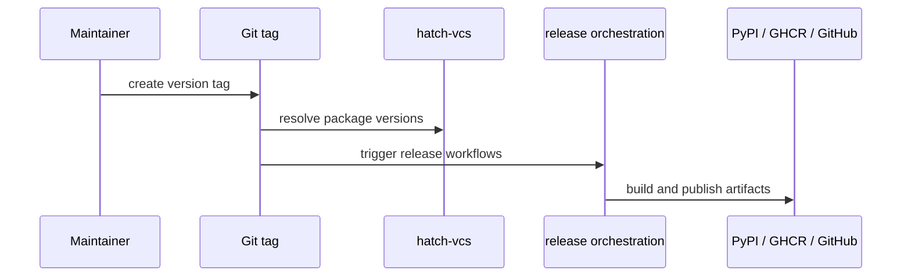

# Release and Versioning

The repository uses conventional commit messages and package-local release
metadata so release intent remains understandable years later.

For every publishable package in this repository, version is resolved from Git tags through `hatch-vcs`, with a checked-in fallback version for source trees that are outside a release tag context.

## Shared Release Facts

- root commit rules live in `pyproject.toml`
- package versions are resolved per package from the shared `v*` tag line
- `release-artifacts.yml` is tag-triggered and orchestrates package build,
  PyPI publication, GHCR publication, and GitHub release publication workflows
- each publishable package owns its own `CHANGELOG.md`

## Purpose

This page connects repository-wide release conventions to the package release
mechanism.

## Stability

Keep it aligned with the release tooling actually configured in the repository.
