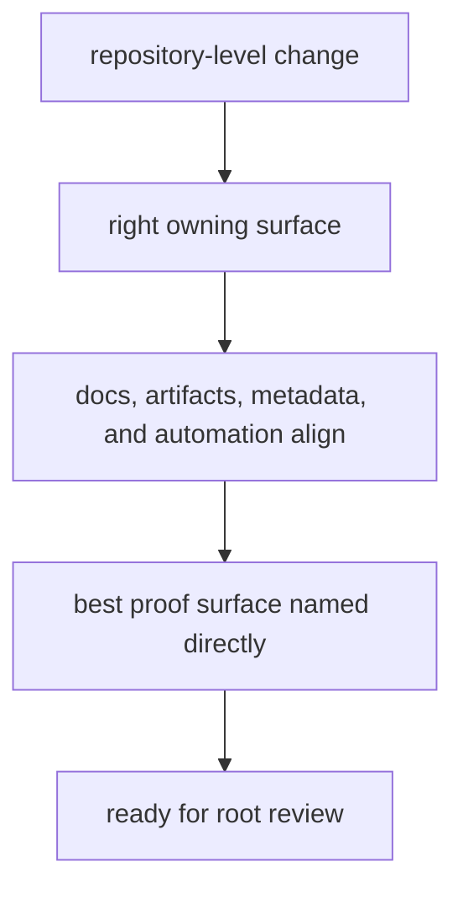

# Review Expectations

Root review should be stricter than a purely local code review because repository
changes can alter how the whole package family is explained, validated, or
released.

## Review Model

This page should make root review feel like a coherence check across several proof classes, not just a stricter style review. If a reviewer cannot point to the best proof surface directly, the change is not ready.

## Non-Negotiable Evidence

- the change lives in the right owning surface
- docs, schema artifacts, metadata, and automation move together when they
  describe the same behavior
- package-local behavior is not smuggled into root or maintainer automation
- the best proof surface is named directly, not implied

## First Proof Check

- the owning handbook branch
- the matching code, tests, tracked artifacts, or workflow files
- staged diff boundaries before commit so one intent stays one review unit

## Design Pressure

The easy failure is to review repository changes with package-local standards and miss the cross-surface drift that only shows up when docs, automation, and contracts are read together.
