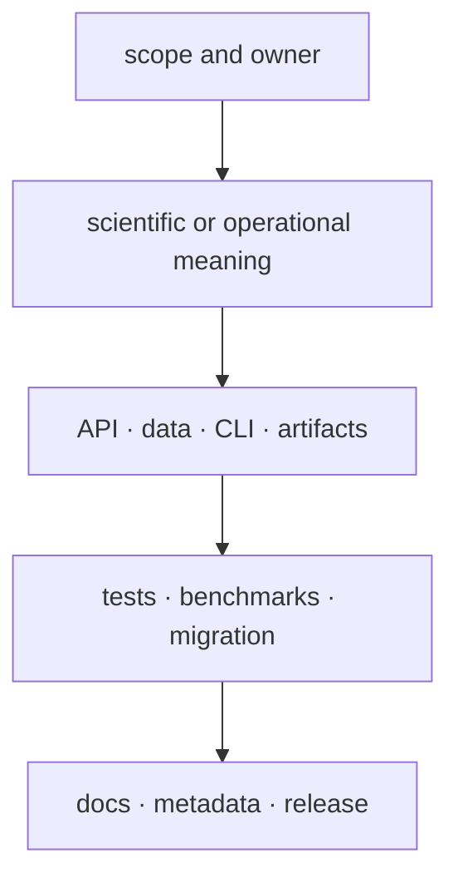

# Review expectations

Review establishes that the change belongs to the right owner, moves every
affected contract deliberately, and carries evidence proportional to its risk.
Style and passing tests do not compensate for an incorrect ownership boundary
or an unexplained scientific consequence.

## Review in risk order

Stop early when the owner is wrong. Detailed line review is wasted if Core
logic is being added to Runtime, a compatibility package is gaining canonical
behavior, or a maintainer helper is defining product policy.

## Evidence by change class

| Change | Review evidence |
| --- | --- |
| scientific algorithm or threshold | curated cases, units, tolerances, failure boundaries, and interpretation impact |
| persisted model or schema | old-load or migration proof, deterministic serialization, and consumer round trip |
| public API, CLI, or import | snapshots, behavior tests, alias impact, and migration guidance |
| runtime execution | state transitions, artifact lineage, replay, failure recovery, and provider boundaries |
| evidence or decision policy | provenance, ambiguity, contradiction, sensitivity, refusal, and explanation |
| lab planning or outcome | authority, readiness, handoff idempotency, QC, deviation, and reconciliation |
| automation or release | command trace, package selection, environment, permissions, and failure propagation |
| public documentation | reader-facing language, source-backed claims, working links, examples, and MkDocs build |

## Diff and commit review

Each commit represents one durable intent and leaves the repository coherent.
Review the staged diff, not only the working tree, so unrelated files and
generated residue do not enter the commit. Generated contract refreshes remain
separate from handwritten changes unless the two are inseparable for
correctness.

Names must describe enduring responsibility rather than delivery sequence or
temporary status. New top-level modules, directories, commands, and public
symbols require an obvious owner and navigation route.

## Completion record

The handoff identifies what changed, the relevant owner, commands run, exact
failures or skipped checks, compatibility impact, and remaining limitations.
Known failures stay visible even when unrelated to the patch. A review is not
complete when a gate was silenced, an exclusion broadened, or output was moved
out of sight.

The reviewer should be able to connect every important claim in the change to
source, a contract, and appropriate evidence without relying on private context
from the author.
