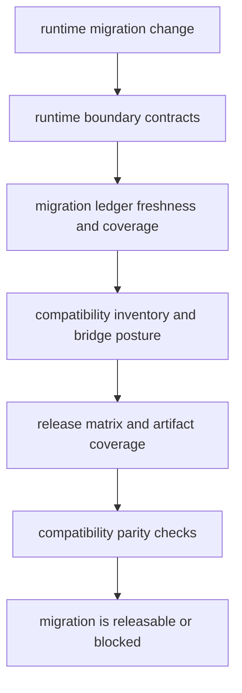

# Runtime Migration Validation

Use this runbook to prove that runtime migration work did not quietly break
canonical execution, legacy compatibility, or release coverage.

## Validation Model



This page should make migration validation feel like a release gate with several linked proofs, not one extra command at the end of a release checklist.

## Validation Command

Run the dedicated suite from repository root:

```bash
make quality-runtime-migration-validation
```

## What It Proves

- lower-layer packages do not import runtime by accident
- the migration ledger is fresh and covers the full legacy module set
- the compatibility bridge stays wrapper-only and does not regain original
  product logic
- tracked API artifacts under `apis/*/v1` still match runtime expectations
- release matrices still include both canonical runtime and compatibility
  surfaces where required
- compatibility import, CLI, and API parity tests still hold

## Coordinated Release Order

1. confirm package metadata and changelog entries for every affected package
2. run shared repository checks such as `make quality`, `make security`, and
   `make test`
3. run `make quality-runtime-migration-validation`
4. verify release matrix variables and workflow coverage
5. confirm release language still names `agentic-proteins` as compatibility and
   `bijux-proteomics-runtime` as the canonical execution owner

## First Proof Check

- `make quality-runtime-migration-validation`
- release workflow inputs and tracked API artifacts
- migration ledger outputs under `docs/09-bijux-proteomics-runtime/migration-ledger/`

## Design Pressure

The common drift is to run the migration suite as a ritual without checking whether the ledger, release matrices, and compatibility proofs still tell the same story.
