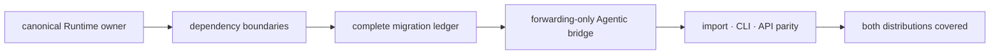

# Runtime migration validation

Runtime migration is the coordinated movement of execution ownership from
historical Agentic Proteins paths to `bijux-proteomics-runtime`. Validation must
prove canonical execution, legacy forwarding, migration-ledger coverage, API
parity, and release packaging together.

## Run the dedicated gate

```bash
make quality-runtime-migration-validation
```

This composite gate checks runtime boundaries, migration-ledger freshness,
compatibility inventory, release coverage, and parity expectations. Use the
narrower ledger gate while editing generated migration records:

```bash
make quality-runtime-migration-ledger
```

## Interpret the proof chain



| Proof | Failure meaning |
| --- | --- |
| boundary validation | a lower layer imports Runtime or execution ownership leaked |
| ledger coverage | a legacy module has no current destination or retirement state |
| bridge inventory | Agentic Proteins regained product behavior instead of forwarding |
| import parity | a documented legacy symbol no longer resolves to the canonical owner |
| CLI/API parity | process or serialized behavior differs across compatibility routes |
| release coverage | one side of the migration can ship without its required counterpart |

## Validate a migration change

1. Change behavior in the canonical owner.
2. Update the forwarding route only when the legacy contract requires it.
3. Regenerate or refresh the compatibility inventory and migration ledger
   through their owning tooling.
4. Run Runtime and Agentic package tests and API checks.
5. Run `make quality-runtime-migration-validation`.
6. Inspect package metadata, dependency floors, changelogs, and release workflow
   matrices for both distributions.

A passing bridge import test is not enough: it can miss CLI exit changes, API
schema drift, missing modules, and publication gaps. A passing Runtime suite is
also insufficient because it does not prove the legacy path reaches Runtime.

## Retirement decisions

A compatibility route is retired only when its ledger conditions are satisfied
and the release communicates the destination and consumer action. Removing a
route from navigation or ceasing to mention it does not retire its contract.
Until retirement, new execution behavior still belongs only in Runtime; the
bridge adapts or forwards without creating a second implementation.

The migration is releasable when the ledger covers every governed legacy
surface, canonical and compatibility contracts agree where promised, package
artifacts contain the intended routes, and release notes state precisely which
promises remain, narrow, or end.
