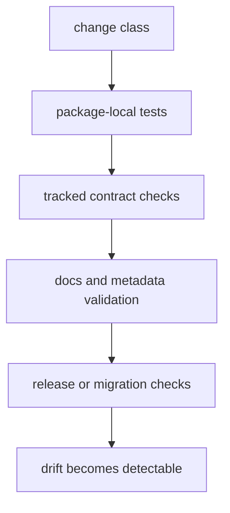

# Testing and Validation

Validation in `bijux-proteomics` is layered. Packages prove their own behavior.
The repository proves seams between packages, tracked contracts, docs, and
release orchestration.

## Validation Model

This page should help a maintainer pick the narrowest proof that still catches the real drift. A change is under-validated when its governing surface moves but the matching detector never runs.

## Change Class To Proof Surface

- package-local behavior: package unit, integration, and invariant tests
- API or schema changes: tracked artifacts under `apis/` plus freeze or drift
  checks
- docs and metadata changes: docs integrity checks and repository validation
- release-path changes: workflow, metadata, and publication guard checks
- runtime migration changes: the dedicated runtime migration validation suite

## First Proof Check

- package test suites under `packages/*/tests`
- tracked contract artifacts under `apis/*/v1`
- repository checks carried by `bijux-proteomics-dev` and workflow entrypoints

## Rule

A prose promise is unfinished until a package test, root check, or tracked
artifact can detect its drift.

## Design Pressure

The easy failure is to over-index on one layer of testing and miss that repository seams, tracked contracts, or release paths changed without a detector following them.
