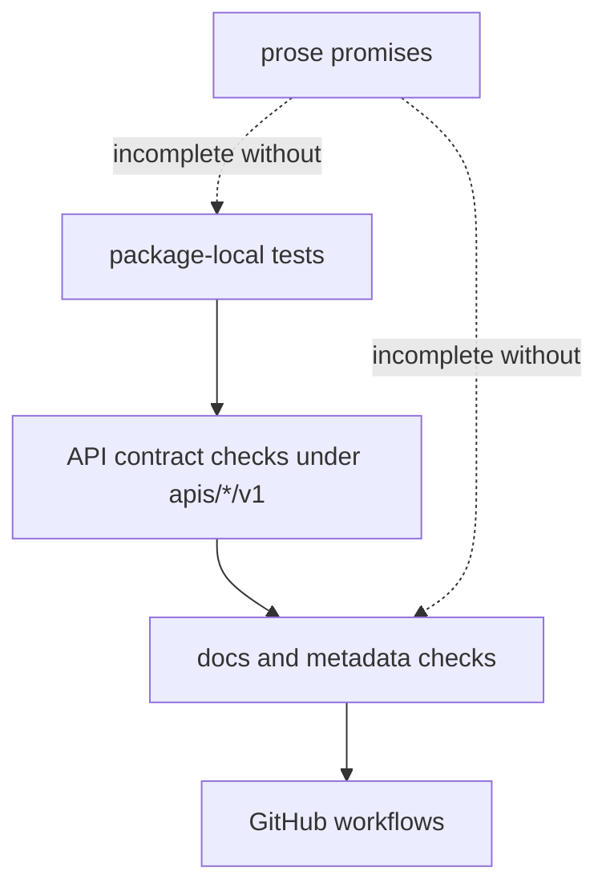

# Testing and Validation

Validation in `bijux-proteomics` is layered: packages protect their own
behavior, while the repository protects the seams between packages, schema
artifacts, docs, and release conventions.

## Validation Layers

- package-local unit, integration, and invariant suites
- API contract checks under `apis/*/v1`
- docs, metadata, and repository checks in `bijux-proteomics-dev`
- repository workflows under `.github/workflows/`

## Validation Rule

A prose promise is incomplete until package tests or repository tooling can
detect its drift.

## Purpose

This page explains the relationship between package truth and repository truth.

## Stability

Keep it aligned with the current test layout and validation workflows.
