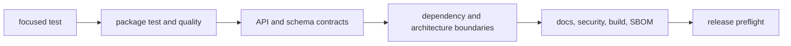
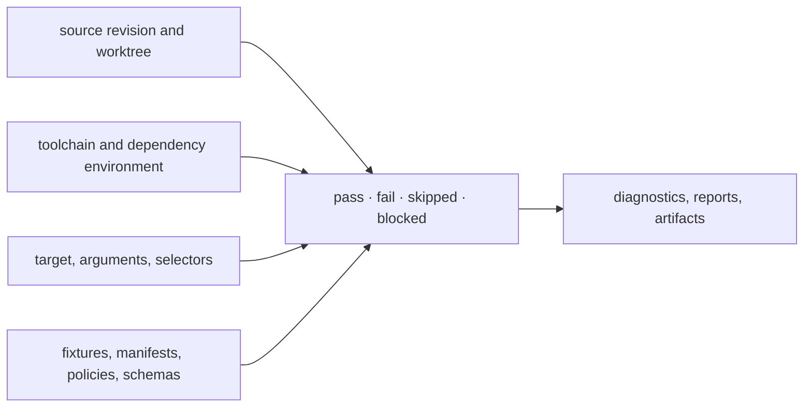

# Testing and validation

Validation is layered because different regressions require different proof.
Package tests establish local behavior. Contract, architecture, documentation,
security, build, and release gates establish that the repository still works as
one published product family.

## Validation ladder



Run every layer whose governed surface changed; passing a broader command does
not make a skipped contract-specific check irrelevant.

## What Makes A Test Result Reviewable



A copied summary without these identities cannot be combined safely with
another gate or another revision. Generated reports belong with the command
that produced them and must retain their governed input identity.

## Change-to-check matrix

| Change | Minimum focused proof | Required broader proof |
| --- | --- | --- |
| package behavior | owning tests and affected invariants | package quality; root `make test` when shared |
| public Python API | public API tests | `make api`, `make quality-public-api-types` |
| JSON or OpenAPI contract | schema tests and representative round trip | `make api-freeze`, `make openapi-drift` |
| package dependency | import smoke test | `make quality-circular-imports`, dependency minimization and optional-dependency guards |
| runtime ownership or compatibility | targeted runtime tests | runtime boundary, migration-ledger, and migration-validation targets |
| documentation | example execution where applicable | link, consistency, and `make docs-check` |
| artifact location or generation | producing test or command | `make quality-artifact-governance` |
| release metadata or workflow | targeted workflow/config validation | `make release-preflight` |

## Core gates

```bash
make test-collection-gate
make test
make lint
make quality
make security
make api
make docs-check
```

The complete repository flow is:

```bash
make check
```

It runs lock validation, lint, collection, tests, quality, security,
documentation, API, builds, and SBOM generation. Results and logs belong below
`artifacts/`; a clean terminal alone is not the evidence when the target emits
a governed report.

## Architecture and runtime gates

Use the dedicated targets when a change touches ownership or execution seams:

```bash
make architecture-check
make quality-architecture-regression
make quality-runtime-boundaries
make quality-runtime-migration-ledger
make quality-runtime-migration-validation
```

These checks answer different questions. The boundary gate detects forbidden
ownership movement; the migration ledger checks coverage and freshness; the
migration validation suite exercises compatibility behavior.

## Documentation proof

Run examples against the installed workspace when they promise executable
behavior. Then validate the rendered site:

```bash
make quality-docs-links
make quality-docs-consistency
make docs-check
```

`docs-check` performs an isolated MkDocs build and checks documentation hygiene.
It should leave the root free of generated site directories.

## Interpreting failures

Do not silence a check or weaken a threshold to obtain a green run. Determine
whether the failure belongs to the change, an existing repository defect, the
environment, or generated drift. Record the exact command, failing package or
artifact, and diagnostic. A known failure remains a failure until its owning
surface is corrected.

| Result | Interpretation | Required handling |
| --- | --- | --- |
| pass | covered contract held for the identified run | retain scope; do not generalize beyond the gate |
| assertion failure | behavior or evidence contradicted the contract | preserve diagnostic, identify owner, correct cause, rerun narrow and affected broader gates |
| collection or import failure | the suite did not reach governed behavior | treat as failure, not zero tested cases |
| skipped test | declared precondition prevented evaluation | justify the precondition and exclude the test from pass claims |
| expected failure | a known defect remains executable and visible | retain defect ownership and closure condition; do not count it as support |
| environment blocked | required tool, service, credential, or governed input was unavailable | record blocker and withhold the corresponding verdict |
| flaky or non-deterministic result | the evidence cannot be reproduced reliably | investigate instability; repeated green runs do not establish deterministic correctness |

After correcting a failure, retain both the failed and passing revision
identities when the failure is material to review. The passing rerun proves the
corrected state; it does not make the original diagnostic disappear.
