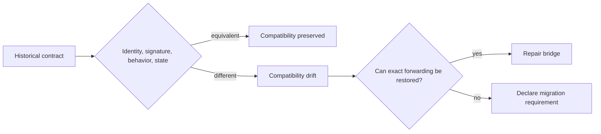

# Architecture Risks

The primary risk in `agentic-proteins` is compatibility drift: a historical path appears to work but no longer resolves to the same contract as `bijux-proteomics-runtime`.

| Risk | Failure mode | Control |
| --- | --- | --- |
| Duplicate implementation | A forwarding module acquires its own scheduler, provider, state, or API behavior | Keep behavior in runtime and assert canonical ownership |
| Object substitution | Historical and canonical imports expose look-alike but distinct classes or callables | Verify object identity for public forwarded symbols |
| Signature drift | Arguments, defaults, return types, or exceptions diverge | Compare public signatures and behavior in compatibility tests |
| Optional-extra drift | A historical extra installs a different capability set | Map extras directly to matching runtime extras |
| State fork | Historical paths read or write a separate store or snapshot shape | Forward state contracts and persistence operations to runtime |
| Error masking | The bridge catches a runtime failure and returns weaker or ambiguous information | Preserve canonical exception and structured error semantics |
| Documentation fork | Historical docs describe features or authority that runtime does not own | Treat runtime documentation as authoritative for behavior |
| New adoption | New applications depend on the historical namespace | Lead migration examples with canonical runtime imports |

Compatibility must not be “mostly equivalent.” Differences in exception type, provider availability, output layout, state identity, or side effects can invalidate automation even when a simple example still runs. If exact forwarding cannot be preserved, the consumer-visible break and canonical migration path must be explicit.

## Close a detected risk

| Finding | Required disposition | Closure evidence |
| --- | --- | --- |
| canonical identity or signature drift | block the affected compatibility release | restored forwarding or a versioned breaking-contract decision with migration guidance |
| behavior, error, state, or artifact drift | classify as bridge defect unless the consumer contract explicitly permits adaptation | paired parity record over success, failure, side effects, and persisted output |
| optional-extra mismatch | block the affected installation surface | resolved dependency mapping and clean-environment capability test |
| undocumented dead namespace | stop promising a replacement | inventory classification, caller search, and removal guidance |
| new compatibility adoption | route the caller to Runtime or Core | dependency review showing the canonical import or command |
| incomplete external-consumer inventory | keep retirement blocked | named support boundary and caller-owned migration dispositions |

Repairing a bridge defect does not prove caller migration. Migrating every
known caller does not prove the inventory is complete. Release and retirement
records must preserve those conclusions separately.
