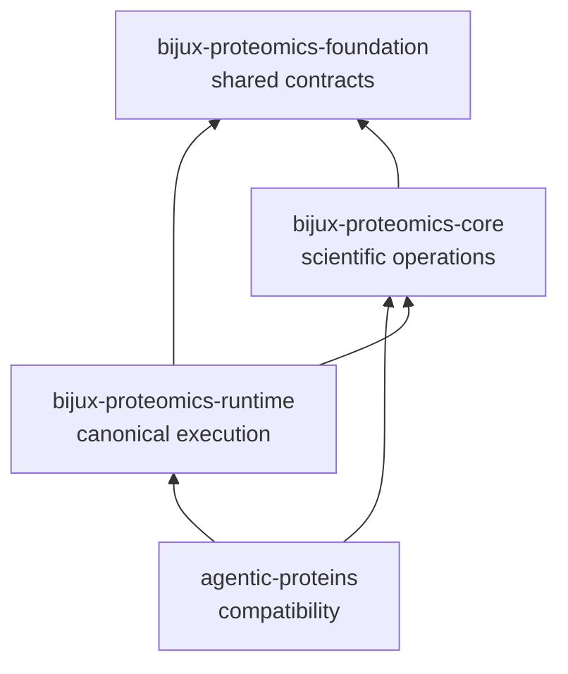

# Dependency direction

The compatibility package depends on core and runtime; no canonical package may
depend on `agentic-proteins`. This one-way rule prevents the historical
namespace from becoming a hidden authority or a required hop between current
packages.

## Allowed dependencies

- Compatibility modules import their canonical symbols from runtime.
- The distribution depends on core because historical consumers may still
  expect core scientific contracts alongside runtime behavior.
- Optional extras delegate API, provider, and natural-language capabilities to
  matching runtime extras.
- Tests may compare historical and canonical paths to prove behavioral and
  type identity.

## Forbidden direction

- Runtime, core, foundation, intelligence, knowledge, and lab must not import
  `agentic_proteins`.
- New domain models must not be defined here for canonical packages to consume.
- A compatibility module must not wrap a runtime result with different status,
  error, serialization, or scientific meaning.
- Provider and tool implementations must not fork here merely to preserve an
  old file path.

## Import identity matters

Forwarding is stronger when the historical import resolves to the canonical
object rather than to a look-alike wrapper. Object identity preserves type
checks, exception handling, serialization, plugin registration, and
documentation links. Where a wrapper is unavoidable, the bridge contract must
name the behavioral difference and retirement condition.

## Dependency review

For any changed bridge module, verify four facts:

1. The target exists in the installed runtime distribution.
2. The forwarded name has the same callable or model contract.
3. Importing the historical path does not introduce a new optional dependency
   relative to the canonical path.
4. No current package has begun importing the compatibility namespace.

The supported version ranges in `packages/agentic-proteins/pyproject.toml` are
part of this contract. Core and runtime are constrained to the same compatible
minor series so a bridge installation cannot silently join incompatible
owners.
