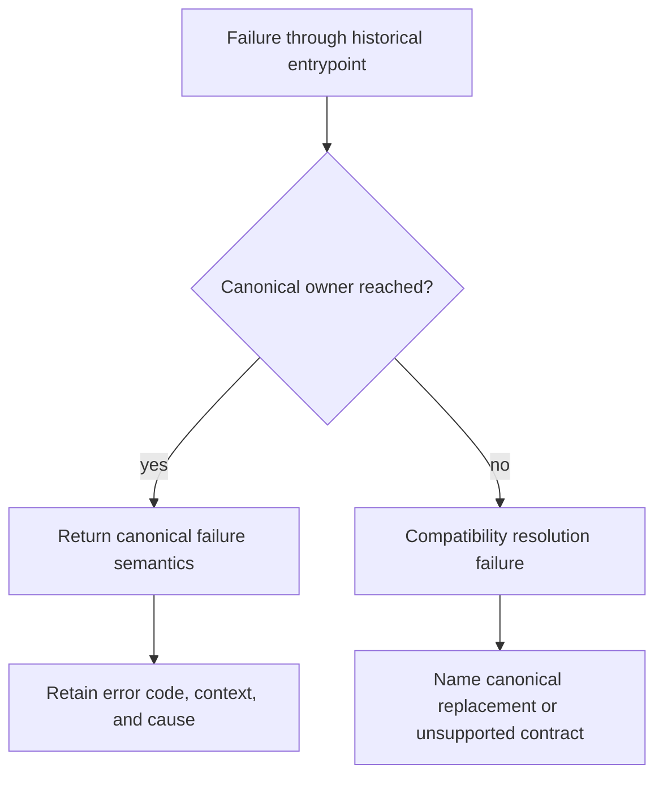

# Error Model

`agentic-proteins` does not define an independent error taxonomy. Historical entrypoints expose the failure semantics of their canonical runtime owners so callers can migrate without learning two models.

## Failure classes

| Class | Example | Expected behavior |
| --- | --- | --- |
| Import compatibility | A historical module or symbol is no longer available | Name the unsupported path and canonical replacement |
| Optional dependency | HTTP, natural-language, or local structure capability is not installed | Preserve the runtime dependency error and required extra |
| Provider selection | Unknown provider, unavailable hardware, or unmet provider contract | Surface runtime provider diagnostics such as `PredictionError` |
| Request validation | Invalid CLI, HTTP, run, or workflow input | Preserve canonical validation detail and non-success status |
| Execution | Timeout, tool failure, invalid graph, or workflow exception | Retain runtime error code, stage context, and run evidence |
| State and artifact | Snapshot, workspace, run record, or artifact cannot be read or written | Fail without creating a second compatibility-owned recovery path |
| Compatibility regression | Historical and canonical behavior differs | Treat as a bridge defect, not a consumer input error |

The bridge may add context identifying the historical path, but it must not convert exceptions into successful empty results, rewrite stable runtime codes, or retry in ways the canonical entrypoint would not. A caller comparing historical and canonical paths should observe the same failure class for the same request.
