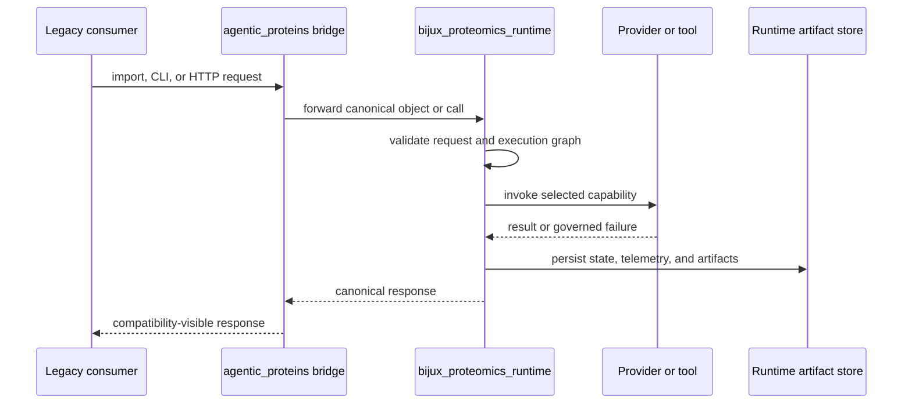

# Execution model

`agentic-proteins` does not execute an independent workflow. A historical CLI,
HTTP, Python, provider, state, or tool entrypoint crosses the compatibility
namespace and then runs the canonical runtime implementation.

## Entry behavior

- `agentic_proteins.AppConfig`, `RunManager`, `cli`, and `create_app` are loaded
  from runtime at attribute access.
- The `agentic-proteins` executable resolves to
  `agentic_proteins.interfaces.cli:cli`, which forwards runtime's CLI surface.
- Historical HTTP modules forward the application factory, dependencies,
  middleware, errors, versioned routes, endpoint handlers, and schemas.
- Historical execution and orchestration modules forward runtime graph,
  compiler, engine, evaluation, run manager, state machine, artifacts,
  telemetry, and recovery behavior.

## State and artifact ownership

Runtime creates and owns run identifiers, state transitions, snapshots,
telemetry, logs, result artifacts, retries, resume behavior, and provider
selection. The bridge exposes historical paths to those objects; it does not
maintain a second state store or translate canonical failures into legacy-only
success states.

## Failure propagation

Import errors identify missing runtime or optional provider dependencies.
Request validation, graph validation, provider failures, execution failures,
and artifact errors retain runtime's exception or response semantics. A bridge
that catches and weakens these failures would violate compatibility by making
the old surface less auditable than the canonical one.

## Proving equivalence

Compatibility tests need to exercise more than import success. High-value
checks compare object identity, function signatures, CLI help and exits, HTTP
schemas and status codes, provider capability reports, state transitions, and
serialized artifacts across the historical and canonical paths.

Use the canonical runtime documentation for execution features. Use this
section when deciding whether an old entrypoint still forwards correctly and
whether it is safe to retire.
